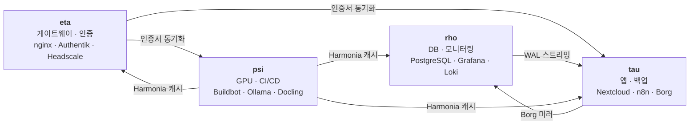
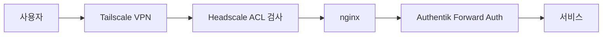

# 아키텍처 개요

## 기술 스택

- **NixOS** + **Flakes** + **flake-parts** — 선언적 시스템 구성
- **sops-nix** (age 암호화) — 시크릿 관리
- **disko** — 선언적 디스크 관리
- **Terraform** — 외부 리소스 관리 (Cloudflare DNS, GitHub)
- **invoke** (`tasks.py`) — 관리 작업 자동화

## 호스트별 서비스 배치



| 호스트 | 위치 | 주요 서비스 |
|--------|------|------------|
| **eta** | Vultr VPS | nginx 리버스 프록시, Authentik SSO, Headscale VPN, Vaultwarden, Gatus, ntfy, Harmonia, ACME 인증서 |
| **psi** | KREN 베어메탈 | Buildbot Master+Workers, Ollama, Docling (GPU), Apptainer, icebox, 16TB NVMe + 60TB HDD |
| **rho** | 랩 내부 베어메탈 | PostgreSQL (프라이머리), Grafana, Prometheus, Loki, Vector, Borg 미러 |
| **tau** | 랩 내부 베어메탈 | Nextcloud, Collabora, n8n, PostgreSQL (레플리카), Borg 백업 저장소 |

호스트별 IP, 네트워크 위치, 방화벽 정책은 [네트워크](network.md)를 참조하세요.

## 인증 흐름



Authentik 그룹이 Headscale ACL과 동기화되어 네트워크 수준의 접근 제어가 이루어집니다. 상세는 [인증](authentication.md)과 [네트워크 — ACL](network.md#acl-%EA%B7%B8%EB%A3%B9)을 참조하세요.

## 리포지토리 구조

```
flake.nix              # 진입점
configurations.nix     # 호스트 목록
hosts/                 # 호스트별 설정 (.nix) + 시크릿 (.yaml)
modules/               # 서비스 모듈
├── hosts.nix          # 호스트 정의 (IP, MAC, 태그)
├── network.nix        # 네트워크 설정
├── users/             # 사용자 관리
├── <service>/         # 서비스별 모듈 + secrets.yaml
└── ...
terraform/             # Cloudflare DNS, GitHub 리소스
tasks.py               # invoke 관리 명령어
```
