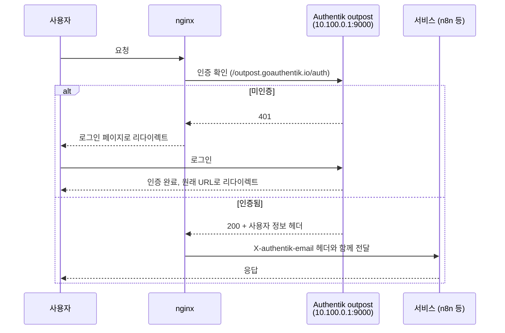

# 인증

## Authentik SSO

`https://auth.sjanglab.org` — 중앙 OIDC/OAuth2 인증 제공자입니다.

### 통합 서비스

| 서비스 | 인증 방식 | 설명 |
|--------|----------|------|
| Headscale | OIDC | VPN 로그인 시 그룹 기반 접근 제어 |
| Nextcloud | OIDC (`user_oidc`) | SSO 로그인 |
| Vaultwarden | OIDC (PKCE) | SSO 로그인 |
| n8n | Forward Auth | nginx에서 인증 후 이메일 헤더 전달 (Headscale ACL + Forward Auth 이중 보호) |
| Buildbot | GitHub OAuth + OIDC | CI/CD 대시보드 접근 |

### Forward Auth 흐름

n8n 등 Forward Auth를 사용하는 서비스의 인증 흐름:

Authentik outpost는 `wg-admin` 인터페이스(포트 9000)에서만 접근 가능합니다.

### 그룹

| 그룹 | 용도 | Headscale ACL 태그 |
|------|------|-------------------|
| `sjanglab-admins` | 전체 접근 권한 | `tag:ai`, `tag:apps`, `tag:monitoring` |
| `sjanglab-researchers` | AI + 앱 접근 | `tag:ai`, `tag:apps` |
| `sjanglab-students` | 앱만 접근 | `tag:apps` |

Authentik 그룹은 Headscale ACL과 15분마다 자동 동기화됩니다. 상세 매커니즘은 [네트워크 — ACL 동기화](network.md#acl-sync)를 참조하세요.
