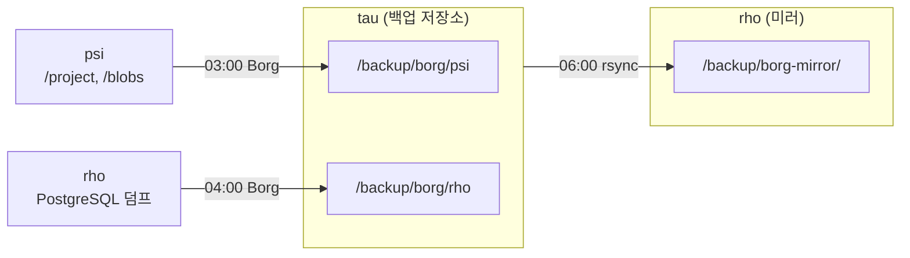

# 백업

Borg Backup으로 증분 백업을 수행합니다.

## 백업 흐름



## 백업 스케줄

| 소스 | 대상 | 시간 | 데이터 |
|------|------|------|--------|
| psi | tau:/backup/borg/psi | 03:00 | `/project`, `/blobs` |
| rho | tau:/backup/borg/rho | 04:00 | PostgreSQL 전체 덤프 |

## 미러링 (3-2-1 규칙)

tau의 Borg 저장소를 rho로 미러링합니다:

- **방향**: tau → rho (`/backup/borg-mirror/`)
- **시간**: 06:00 (백업 완료 후)
- **방식**: rsync (`--delete` 동기화)

## Borg 설정

- 암호화: `repokey-blake2`
- 압축: `auto,zstd,10`
- SSH 포트: `10022`

## 보관 정책

| 주기 | psi (파일) | rho (PostgreSQL) |
|------|-----------|------------------|
| 일간 | 7 | 7 |
| 주간 | 4 | 4 |
| 월간 | 3 | 6 |

> PostgreSQL 덤프는 데이터 복구 기간을 길게 확보하기 위해 월간 보관을 6개월로 설정합니다.

## 제외 항목

```
*.pyc, .cache, .nix-profile, __pycache__, node_modules,
.cargo, .direnv, .jj, .ruff_cache, .terraform*, target
```
