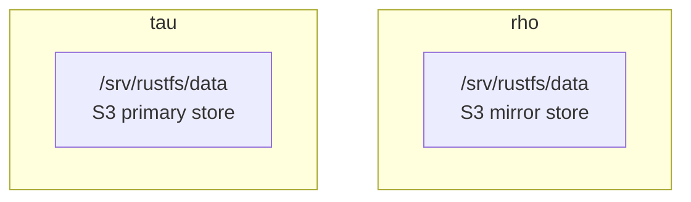
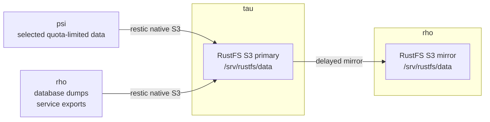

# 백업

백업 저장소는 Borg에서 S3 기반 저장소로 전환 중입니다.

## 저장소 배치

rho와 tau의 HDD RAID0 배열은 백업 저장소 전용 공간으로 사용합니다. 기존 mountpoint `/backup`은 폐기하고 `/srv`를 사용합니다.


```mermaid
flowchart TB
  subgraph rho["rho"]
    rho_srv["/srv/rustfs/data<br/>S3 mirror store"]
  end

  subgraph tau["tau"]
    tau_srv["/srv/rustfs/data<br/>S3 primary store"]
  end
```

## 목표 흐름


```mermaid
flowchart LR
  psi["psi<br/>selected quota-limited data"]
  rho_src["rho<br/>database dumps<br/>service exports"]

  subgraph tau["tau"]
    tau_s3["RustFS S3 primary<br/>/srv/rustfs/data"]
  end

  subgraph rho["rho"]
    rho_s3["RustFS S3 mirror<br/>/srv/rustfs/data"]
  end

  psi -- "restic native S3" --> tau_s3
  rho_src -- "restic native S3" --> tau_s3
  tau_s3 -- "delayed mirror" --> rho_s3
```

## RustFS bootstrap

`services.rustfs`는 daemon과 bucket bootstrap을 함께 선언합니다. Bucket 같은 object store 내부 state는 `rustfs-bootstrap.service`가 RustFS readiness를 기다린 뒤 S3-compatible client로 적용합니다.

`rustfs-bootstrap.service`는 선언된 object-store state를 다음 순서로 수렴합니다.

- `services.rustfs.ensureBuckets`: bucket 생성, bucket versioning enable, versioning 상태 확인
- `services.rustfs.ensurePolicies`: canned IAM policy 생성/갱신
- `services.rustfs.ensureUsers`: access key/user 생성, policy attach

선언에서 제거한 user/policy는 RustFS에서 자동 삭제하지 않습니다. 폐기된 credential은 bootstrap 후 별도 `mc admin user rm` 절차로 제거합니다.

RustFS root credential은 bootstrap과 break-glass 용도로만 사용합니다. restic job은 별도 writer/prune/restore credential을 사용해야 합니다. RustFS console UI는 현재 upstream package에서 static asset이 빠져 있어 운영 절차에 포함하지 않습니다.

## RustFS monitoring

`services.rustfs.monitoring`은 daemon liveness만 담당합니다.

- Gatus: `/health/ready` readiness check
- Loki: `rustfs.service`, `rustfs-bootstrap.service` journald logs
- Prometheus: `/srv` filesystem freshness and free-space alerts

Backup/check/prune/restore drill freshness는 `systemd_status` Loki stream에 포함됩니다. psi는 protected data와 Nixbot PostgreSQL job을, rho는 PostgreSQL backup과 delayed mirror job을 기록합니다.

## psi 백업 범위

psi 전체를 백업하지 않습니다. S3 primary에는 quota 안에 들어오는 protected subset만 저장합니다.

백업 대상:

- `/project`
- `/blobs` 전체
- `/blobs`는 XFS project quota 200GB와 restic source guard로 상한을 강제합니다.
- `/project`는 restic source guard로 10GiB 상한을 강제합니다.
- restore drill은 `/project/.rustic-backup-sentinel` 단일 파일 복원과 비교로 수행합니다.

백업 제외:

- `/data` 전체
- `/workspace` 전체
- `/nix/store`
- public bioinformatics database mirror
- cache, work, temp, intermediate

## PostgreSQL 백업 범위

Streaming replica는 장애 대응용이고 백업으로 간주하지 않습니다. PostgreSQL은 논리 덤프를 만든 뒤 restic native S3로 tau primary RustFS에 저장합니다.

백업 대상:

- rho: `terraform`, `nextcloud`, `n8n`
- psi: `nixbot`
- globals: `pg_dumpall --globals-only`
- database dump: `pg_dump --format=custom --create --clean --if-exists`

저장소:

- rho: `backups/rho/postgresql/`
- psi: `backups/psi/postgresql/`

스케줄과 보관:

- dump + backup: daily (`rho` 04:30, `psi` 02:30)
- check: monthly, reader credential
- prune: weekly, pruner credential
- retention: daily 7, weekly 4, monthly 6
- restore drill: weekly, latest snapshot에서 `globals.sql`과 custom dump를 복원하고 `pg_restore --list`로 검증

## tau→rho delayed mirror

rho가 tau primary RustFS에서 pull 방식으로 secondary RustFS에 복사합니다.

- units: `backup-mirror-psi-protected.service`, `backup-mirror-psi-postgresql.service`, `backup-mirror-rho-postgresql.service`
- timer: daily, `RandomizedDelaySec=2h`
- sources: `tau:backups/psi/protected/`, `tau:backups/psi/postgresql/`, `tau:backups/rho/postgresql/`
- destinations: matching prefixes on rho RustFS
- rclone options: `copy --immutable --min-age 24h --exclude 'locks/**' --s3-no-check-bucket`

즉시 delete propagation은 하지 않습니다. tau에서 사라진 object도 rho에 남으므로 prune/delete 실수에 대한 지연 완충 역할을 합니다. source는 psi restic reader credential을 사용하고, destination은 rho-local mirror credential을 사용합니다.

## 기존 Borg 상태

기존 Borg 저장소는 S3 전환 과정에서 폐기 대상입니다.

- tau의 기존 `/backup/borg/psi`는 이전 원격 백업입니다.
- tau의 기존 `/backup/borg/rho`는 유효한 Borg repository가 아니었습니다.
- rho의 기존 `/backup/borg-mirror`는 비어 있었습니다.

새 저장소는 `/srv`에서 구성하며 `/backup` 호환 mount나 symlink는 만들지 않습니다.

## 복구 runbook

### 공통 절차

1. Grafana `SjangLab Jobs`와 `systemd_status` 로그에서 마지막 성공 시각을 확인합니다.
1. 대상 repository와 snapshot을 확인합니다.
1. 원본 경로에 바로 복원하지 말고 `/var/lib/restic-restore/<repository>` 같은 임시 경로로 복원합니다.
1. 파일 소유권, 권한, dump 무결성을 확인한 뒤 필요한 경로에 반영합니다.
1. 복구 완료 후 사고 타임라인, 사용한 snapshot, 누락 데이터 범위를 기록합니다.

### psi protected data 복원

`/project`와 `/blobs` protected subset은 `psi-protected` restic repository에 저장됩니다.

```bash
ssh -p 10022 root@psi
systemctl start restic-restore-drill-psi-protected.service
journalctl -u restic-restore-drill-psi-protected.service -e
```

전체 파일 복원이 필요하면 reader credential 환경을 사용해 임시 경로로 복원합니다. 대용량 복원 전에는 tau RustFS 여유 공간과 psi 대상 경로 quota를 먼저 확인합니다.

```bash
ssh -p 10022 root@psi
mkdir -p /var/lib/restic-restore/manual-psi-protected
systemctl cat restic-restore-drill-psi-protected.service
# 위 unit의 RESTIC_REPOSITORY, RESTIC_PASSWORD_FILE, EnvironmentFile 값을 재사용해 restic restore 실행
```

### PostgreSQL dump 복원

PostgreSQL은 logical dump를 restic repository에 저장합니다. 운영 DB에 바로 덮어쓰지 않고 staging DB에서 먼저 검증합니다.

```bash
ssh -p 10022 root@rho
systemctl start restic-restore-drill-rho-postgresql.service
journalctl -u restic-restore-drill-rho-postgresql.service -e
```

수동 복원 절차:

1. `restic restore`로 최신 snapshot을 `/var/lib/restic-restore/<repository>`에 복원합니다.
1. `globals.sql`과 `*.dump` 파일 존재를 확인합니다.
1. `pg_restore --list <db>.dump`로 dump 구조를 확인합니다.
1. 필요하면 staging database를 만들어 `pg_restore --clean --if-exists --create`로 복원 테스트합니다.
1. 운영 반영은 서비스 중단 공지 후 maintenance window에서 수행합니다.

### tau primary 장애 시 rho mirror 사용

rho mirror는 delayed copy라 최신 snapshot이 tau보다 늦을 수 있습니다. tau primary 장애 시:

1. rho RustFS의 대상 prefix에 snapshot이 존재하는지 확인합니다.
1. 마지막 mirror 성공 시각으로 RPO를 계산합니다.
1. restic repository URL을 rho RustFS endpoint로 바꿔 임시 복원합니다.
1. tau 복구 후 mirror 방향을 임의로 반전하지 않습니다. 필요한 object만 검증 후 수동 복사합니다.

### credential 유출/오동작 대응

- writer credential 유출: 해당 writer user를 새 키로 교체하고 기존 키를 RustFS에서 제거합니다.
- pruner credential 유출: 즉시 prune/delete 권한을 회수하고 rho delayed mirror를 보존합니다.
- root credential 사용: bootstrap/break-glass 목적만 허용하고 사용 후 즉시 rotation합니다.

## 운영 원칙

- 백업 대상은 경로 전체가 아니라 보호 등급과 quota로 관리합니다.
- tau S3는 primary backup store입니다.
- rho S3는 delayed mirror입니다.
- delete propagation은 즉시 전파하지 않습니다.
- bucket versioning을 사용합니다.
- writer credential과 prune/delete credential은 분리합니다.
- restore drill 완료 전에는 새 backup 체계를 완료로 보지 않습니다.
