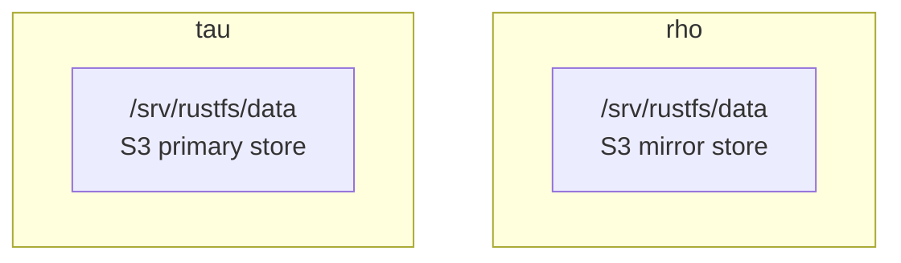
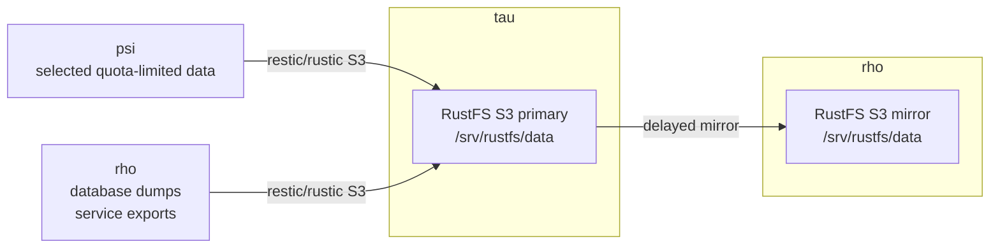

# 백업

백업 저장소는 Borg에서 S3 기반 저장소로 전환 중입니다.

## 저장소 배치

rho와 tau의 HDD RAID0 배열은 백업 저장소 전용 공간으로 사용합니다. 기존 mountpoint `/backup`은 폐기하고 `/srv`를 사용합니다.

```mermaid
flowchart TB
  subgraph rho["rho"]
    rho_srv["/srv/rustfs/data<br/>S3 mirror store"]
  end

  subgraph tau["tau"]
    tau_srv["/srv/rustfs/data<br/>S3 primary store"]
  end
```

## 목표 흐름

```mermaid
flowchart LR
  psi["psi<br/>selected quota-limited data"]
  rho_src["rho<br/>database dumps<br/>service exports"]

  subgraph tau["tau"]
    tau_s3["RustFS S3 primary<br/>/srv/rustfs/data"]
  end

  subgraph rho["rho"]
    rho_s3["RustFS S3 mirror<br/>/srv/rustfs/data"]
  end

  psi -- "restic/rustic S3" --> tau_s3
  rho_src -- "restic/rustic S3" --> tau_s3
  tau_s3 -- "delayed mirror" --> rho_s3
```

## psi 백업 범위

psi 전체를 백업하지 않습니다. S3 primary에는 quota 안에 들어오는 protected subset만 저장합니다.

백업 대상:

- `/project`
- `/blobs/critical`
- 명시적으로 승격한 최종 산출물
- manifest, checksum, accession/version 목록

백업 제외:

- `/data` 전체
- `/workspace` 전체
- `/nix/store`
- public bioinformatics database mirror
- cache, work, temp, intermediate

## 기존 Borg 상태

기존 Borg 저장소는 S3 전환 과정에서 폐기 대상입니다.

- tau의 기존 `/backup/borg/psi`는 이전 원격 백업입니다.
- tau의 기존 `/backup/borg/rho`는 유효한 Borg repository가 아니었습니다.
- rho의 기존 `/backup/borg-mirror`는 비어 있었습니다.

새 저장소는 `/srv`에서 구성하며 `/backup` 호환 mount나 symlink는 만들지 않습니다.

## 운영 원칙

- 백업 대상은 경로 전체가 아니라 보호 등급과 quota로 관리합니다.
- tau S3는 primary backup store입니다.
- rho S3는 delayed mirror입니다.
- delete propagation은 즉시 전파하지 않습니다.
- bucket versioning을 사용합니다.
- writer credential과 prune/delete credential은 분리합니다.
- restore drill 완료 전에는 새 backup 체계를 완료로 보지 않습니다.
