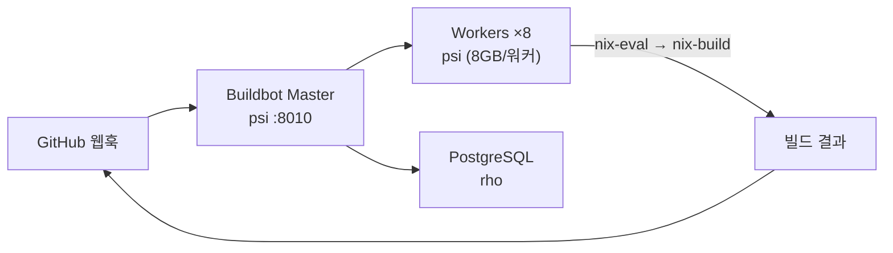
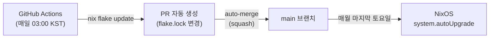

# CI/CD

## Buildbot

`https://buildbot.sjanglab.org` — GitHub 연동 CI/CD입니다.

### 구성

- **Master**: psi (포트 8010)
- **Workers**: psi (8개 평가 워커, 8GB 메모리/워커)
- **DB**: PostgreSQL (rho)

### 빌드 트리거

- GitHub 웹훅으로 자동 트리거
- `build-with-buildbot` 토픽이 설정된 리포지토리 자동 감지
- PR 생성/업데이트 시 `nix-eval` → `nix-build` 파이프라인 실행

### 권한

| 항목 | 값 | 설정 위치 |
|------|-----|-----------|
| 빌드 트리거 | `SBEE-Lab` 조직, `mulatta` 사용자 | `master.nix`: `github.authType.app` |
| 웹 관리자 | `mulatta` | `master.nix`: `admins` |
| 인증 | GitHub OAuth | `master.nix`: `authBackend = "github"` |

관련 시크릿 (`modules/buildbot/secrets.yaml`, sops 암호화):

| 시크릿 | 용도 |
|--------|------|
| `github-app-private-key` | GitHub App 인증 (웹훅 수신) |
| `github-oauth-secret` | 웹 UI 로그인 |
| `github-webhook-secret` | 웹훅 HMAC 검증 |
| `buildbot-workers` | 워커 인증 |
| `buildbot-pgpass` | PostgreSQL 접근 |
| `niks3-auth-token` | 외부 캐시 푸시 |

### 관리자 변경

Buildbot 관리자를 변경하려면:

1. `modules/buildbot/master.nix`에서 `admins` 목록 수정
1. GitHub App 설정에서 조직/사용자 권한 업데이트
1. OAuth 시크릿 갱신 필요 시 `sops modules/buildbot/secrets.yaml`로 편집
1. `inv deploy --hosts psi`

### 빌드 재트리거

실패한 빌드는 Buildbot 웹 UI에서 수동으로 재트리거할 수 있습니다. `https://buildbot.sjanglab.org`에 GitHub 계정으로 로그인한 뒤, 해당 빌드 페이지에서 **Rebuild** 버튼을 클릭합니다.

## Flake 입력 자동 업데이트

GitHub Actions가 매일 `nix flake update`를 실행하여 의존성을 최신 상태로 유지합니다.

| 항목 | 설정 |
|------|------|
| 워크플로우 | `.github/workflows/update-flake-inputs.yml` |
| 스케줄 | `0 18 * * *` (매일 18:00 UTC / 03:00 KST) |
| 도구 | `Mic92/update-flake-inputs` |
| 인증 | GitHub App (APP_ID + APP_PRIVATE_KEY) |
| 병합 | auto-merge 워크플로우가 PR을 자동 squash 병합 |

흐름: flake.lock 변경 → PR 생성 → 자동 squash 병합 → main에 반영 → 각 호스트가 매월 마지막 토요일에 `system.autoUpgrade`로 적용.

> Buildbot은 flake 업데이트와 무관합니다. Buildbot은 PR CI 빌드만 담당하고, flake 입력 업데이트는 GitHub Actions가 전담합니다.

## Nix 바이너리 캐시

### Harmonia (내부 캐시)

psi에서 빌드한 `/nix/store` 경로를 Harmonia 데몬이 네트워크로 제공합니다. 다른 호스트가 배포 시 이 캐시에서 빌드 결과를 가져오므로 중복 빌드를 피할 수 있습니다.

| 항목 | 값 |
|------|-----|
| 호스트 | psi |
| 포트 | 5000 (`wg-admin` 인터페이스) |
| 주소 | `http://10.100.0.2:5000` |
| 서명 키 | `secrets.yaml` (sops 암호화) |

모든 호스트(rho, tau, eta)는 이 주소를 Nix substituter로 자동 설정되어 있습니다.
