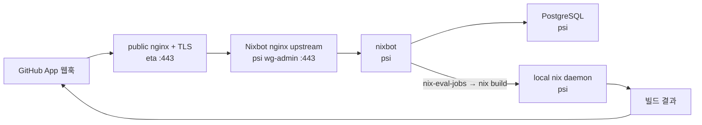
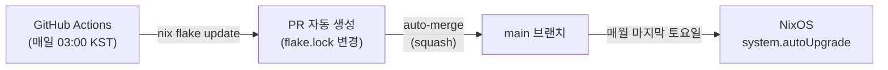

# CI/CD

## Nixbot

`https://buildbot.sjanglab.org` — GitHub 연동 Nix CI/CD입니다. 도메인과 check context는 기존 GitHub branch protection을 유지하기 위해 `buildbot` 이름을 계속 사용합니다.

### 구성

```mermaid
flowchart LR
  gh["GitHub App 웹훅"] --> edge["public nginx + TLS<br/>eta :443"]
  edge --> proxy["Nixbot nginx upstream<br/>psi wg-admin :443"]
  proxy --> svc["nixbot<br/>psi"]
  svc --> db["PostgreSQL<br/>psi"]
  svc -- "nix-eval-jobs → nix build" --> nix["local nix daemon<br/>psi"]
  nix --> result["빌드 결과"]
  result --> gh
```

- **Service host**: psi (`nixbot.service`)
- **Public reverse proxy/TLS**: eta (포트 443), wg-admin으로 psi nginx에 프록시
- **DB**: PostgreSQL (psi, local peer auth)
- **Build execution**: psi의 local nix daemon
- **Check context prefix**: `buildbot` (`buildbot/nix-eval`, `buildbot/nix-build ...`)

### 빌드 트리거

- GitHub App-level 웹훅으로 자동 트리거
- GitHub App이 접근 가능한 리포지토리를 Nixbot이 discovery
- 첫 import 때 `build-with-buildbot` 토픽 리포지토리 enable
- 이후에는 웹 UI에서 admin이 project enable/disable
- PR 생성/업데이트와 default branch push 때 `.#checks` 평가/빌드

### 권한

| 항목 | 값 | 설정 위치 |
|------|-----|-----------|
| 빌드 대상 | `SBEE-Lab` 조직, `mulatta` 사용자 | `modules/buildbot/master.nix`: `github.userAllowlist` |
| 웹 관리자 | `github:mulatta` | `modules/buildbot/master.nix`: `admins` |
| 인증 | GitHub OAuth | `services.nixbot.github.oauth*` |

관련 시크릿 (`modules/buildbot/secrets.yaml`, sops 암호화):

| 시크릿 | 용도 |
|--------|------|
| `github-app-private-key` | GitHub App 인증 |
| `github-oauth-secret` | 웹 UI 로그인 |
| `github-webhook-secret` | 웹훅 HMAC 검증 |
| `niks3-auth-token` | 선택 리포지토리 외부 캐시 푸시 |

### GitHub App 설정

GitHub App 설정은 Nixbot 형식으로 유지해야 합니다.

| 항목 | 값 |
|------|-----|
| Webhook URL | `https://buildbot.sjanglab.org/webhooks/github` |
| OAuth callback | `https://buildbot.sjanglab.org/auth/github/callback` |
| Repository permissions | Contents: Read-only, Checks: Read & write, Metadata: Read-only, Pull requests: Read-only |
| Events | Push, Pull request, Check run, Check suite |

권한을 변경하면 각 installation에서 새 권한 승인이 필요합니다.

### 관리자 변경

Nixbot 관리자를 변경하려면:

1. `modules/buildbot/master.nix`에서 `admins` 목록 수정 (`github:<login>` 형식)
1. GitHub App 설정에서 조직/사용자 권한 업데이트
1. OAuth 시크릿 갱신 필요 시 `sops modules/buildbot/secrets.yaml`로 편집
1. `inv deploy --hosts psi`

### 빌드 재트리거

실패한 빌드는 Nixbot 웹 UI에서 수동으로 재트리거할 수 있습니다. `https://buildbot.sjanglab.org`에 GitHub 계정으로 로그인한 뒤, 해당 빌드 페이지에서 재시작 버튼을 클릭합니다.

### 외부 캐시 푸시

Nixbot은 `mulatta/dots`, `mulatta/seqtable` 빌드 성공 결과만 `https://niks3.mulatta.io`로 push합니다. 전체 빌드는 psi의 Harmonia cache에서 계속 제공됩니다.

## Flake 입력 자동 업데이트

GitHub Actions가 매일 `nix flake update`를 실행하여 의존성을 최신 상태로 유지합니다.

```mermaid
flowchart LR
  cron["GitHub Actions<br/>(매일 03:00 KST)"] -- "nix flake update" --> pr["PR 자동 생성<br/>(flake.lock 변경)"]
  pr -- "auto-merge<br/>(squash)" --> main["main 브랜치"]
  main -- "매월 마지막 토요일" --> upgrade["NixOS<br/>system.autoUpgrade"]
```

| 항목 | 설정 |
|------|------|
| 워크플로우 | `.github/workflows/update-flake-inputs.yml` |
| 스케줄 | `0 18 * * *` (매일 18:00 UTC / 03:00 KST) |
| 도구 | `Mic92/update-flake-inputs` |
| 인증 | GitHub App (APP_ID + APP_PRIVATE_KEY) |
| 병합 | auto-merge 워크플로우가 PR을 자동 squash 병합 |

흐름: flake.lock 변경 → PR 생성 → 자동 squash 병합 → main에 반영 → 각 호스트가 매월 마지막 토요일에 `system.autoUpgrade`로 적용.

> Nixbot은 flake 업데이트와 무관합니다. Nixbot은 PR CI 빌드만 담당하고, flake 입력 업데이트는 GitHub Actions가 전담합니다.

## Nix 바이너리 캐시

### Harmonia (내부 캐시)

psi에서 빌드한 `/nix/store` 경로를 Harmonia 데몬이 네트워크로 제공합니다. 다른 호스트가 배포 시 이 캐시에서 빌드 결과를 가져오므로 중복 빌드를 피할 수 있습니다.

| 항목 | 값 |
|------|-----|
| 호스트 | psi |
| 포트 | 5000 (`wg-admin` 인터페이스) |
| 주소 | `http://10.100.0.2:5000` |
| 서명 키 | `secrets.yaml` (sops 암호화) |

모든 호스트(rho, tau, eta)는 이 주소를 Nix substituter로 자동 설정되어 있습니다.
