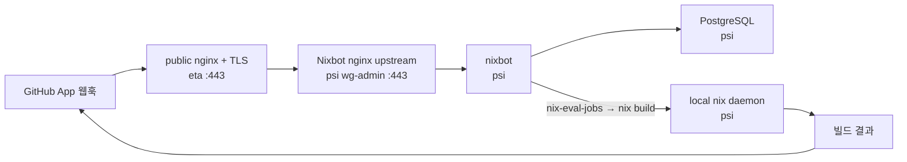
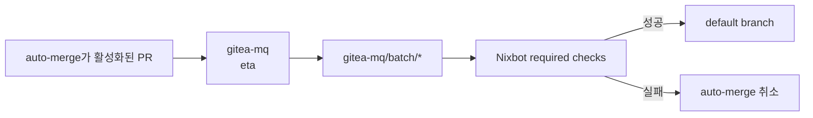
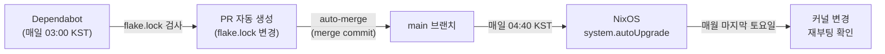

# CI/CD

## Nixbot

`https://nixbot.sjanglab.org` — GitHub 연동 Nix CI/CD입니다. 도메인과 check context는 기존 GitHub branch protection을 유지하기 위해 `buildbot` 이름을 계속 사용합니다.

### 구성


```mermaid
flowchart LR
  gh["GitHub App 웹훅"] --> edge["public nginx + TLS<br/>eta :443"]
  edge --> proxy["Nixbot nginx upstream<br/>psi wg-admin :443"]
  proxy --> svc["nixbot<br/>psi"]
  svc --> db["PostgreSQL<br/>psi"]
  svc -- "nix-eval-jobs → nix build" --> nix["local nix daemon<br/>psi"]
  nix --> result["빌드 결과"]
  result --> gh
```

- **Service host**: psi (`nixbot.service`)
- **Public reverse proxy/TLS**: eta (포트 443), wg-admin으로 psi nginx에 프록시
- **DB**: PostgreSQL (psi, local peer auth)
- **Build execution**: psi의 local nix daemon
- **Check context prefix**: `buildbot` (`buildbot/nix-eval`, `buildbot/nix-build ...`)

### 빌드 트리거

- GitHub App-level 웹훅으로 자동 트리거
- GitHub App이 접근 가능한 리포지토리를 Nixbot이 discovery
- 첫 import 때 `build-with-buildbot` 토픽 리포지토리 enable
- 이후에는 웹 UI에서 admin이 project enable/disable
- PR 생성/업데이트와 default branch push 때 `.#checks` 평가/빌드

### 권한

| 항목 | 값 | 설정 위치 |
|------|-----|-----------|
| 빌드 대상 | `SBEE-Lab` 조직, `mulatta` 사용자 | `modules/buildbot/master.nix`: `github.userAllowlist` |
| 웹 관리자 | `github:mulatta` | `modules/buildbot/master.nix`: `admins` |
| 인증 | GitHub OAuth | `services.nixbot.github.oauth*` |

관련 시크릿 (`modules/buildbot/secrets.yaml`, sops 암호화):

| 시크릿 | 용도 |
|--------|------|
| `github-app-private-key` | GitHub App 인증 |
| `github-oauth-secret` | 웹 UI 로그인 |
| `github-webhook-secret` | 웹훅 HMAC 검증 |
| `niks3-sjanglab-auth-token` | 인프라 cache를 `niks3.sjanglab.org`로 push |

### GitHub App 설정

GitHub App 설정은 Nixbot 형식으로 유지해야 합니다.

| 항목 | 값 |
|------|-----|
| Webhook URL | `https://nixbot.sjanglab.org/webhooks/github` |
| OAuth callback | `https://nixbot.sjanglab.org/auth/github/callback` |
| Repository permissions | Contents: Read & write, Checks: Read & write, Issues: Read & write, Metadata: Read-only, Pull requests: Read & write |
| Events | Push, Pull request, Check run, Check suite |

`Contents` 쓰기 권한은 docs effect의 `gh-pages` push와 updater의 update branch push에 필요합니다. `Pull requests` 쓰기 권한은 updater PR 생성에, `Issues` 쓰기 권한은 `auto-merge` label 추가에 필요합니다. 권한을 변경하면 각 installation에서 새 권한 승인이 필요합니다.

### 관리자 변경

Nixbot 관리자를 변경하려면:

1. `modules/buildbot/master.nix`에서 `admins` 목록 수정 (`github:<login>` 형식)
1. GitHub App 설정에서 조직/사용자 권한 업데이트
1. OAuth 시크릿 갱신 필요 시 `sops modules/buildbot/secrets.yaml`로 편집
1. `inv deploy --hosts psi`

### 빌드/effect 재트리거

실패한 빌드와 effect는 Nixbot 웹 UI에서 수동으로 재트리거할 수 있습니다. `https://nixbot.sjanglab.org`에 GitHub 계정으로 로그인한 뒤, 해당 빌드 페이지에서 재시작 버튼을 클릭합니다.

### Hercules-style effects

리포지토리의 `flake.herculesCI`가 Nixbot effect를 정의합니다. Nixbot은 effect 실행 시 GitHub App installation token을 `GitToken` secret으로 전달하고, effect는 이 token으로 git push와 GitHub CLI 작업을 수행합니다.

| Effect | Trigger | 동작 |
|--------|---------|------|
| `docs-pages` | `main` push | `.#docs` 결과를 `gh-pages` 브랜치로 force-push합니다. GitHub Pages source는 `terraform/github/repo.tf`에서 `gh-pages` `/`로 관리합니다. |
| `update-packages` | 매일 03:00 UTC | `.#updater -- --pr`를 실행해 updateable package별 PR을 생성합니다. |

### GitHub Actions release runner

`psi`에는 Docker/BuildKit 및 GPU 검증이 필요한 신뢰된 release workflow 전용 GitHub Actions runner 구성이 있습니다. Runner는 NixOS의 `services.github-runners` systemd service와 dynamic user로 직접 실행되며, k3s Pod나 Docker container 안에서 실행되지 않습니다. Dockerfile의 각 build step은 BuildKit이 별도 container root filesystem에서 실행합니다.

Runner configuration은 `hosts/psi.nix`의 `services.github-runners.release-runner`에 있습니다. 기본 labels는 `self-hosted`, `Linux`, `X64`와 다음 custom labels입니다.

- `psi`
- `gpu`
- `trusted-release`
- `container-release`

Workflow는 네 custom labels를 모두 지정해야 합니다.

```yaml
runs-on: [self-hosted, psi, gpu, trusted-release, container-release]
```

Runner는 host Docker socket을 사용할 수 있으므로 사실상 `psi`의 root와 동등한 권한을 가집니다. Runner group에는 fork/PR workflow를 허용하지 않고, protected branch나 수동 승인된 release workflow만 허용합니다. Runner에는 release Registry의 push-only credential만 workflow secret으로 제공하고 삭제 권한이 있는 Registry 관리자 credential이나 GitHub App private key는 제공하지 않습니다.

#### 최초 활성화

1. GitHub `SBEE-Lab` organization settings에서 `release-runner` runner group을 만듭니다.

1. Group repository access를 `SBEE-Lab/containers` 등 명시적으로 승인한 release repository로 제한합니다.

1. Organization을 resource owner로 하는 fine-grained PAT를 만들고 Organization permissions의 `Self-hosted runners`를 read/write로 설정합니다. Workflow repository의 contents 권한은 필요하지 않습니다.

1. Token을 출력하거나 저장소에 평문으로 기록하지 말고 다음 명령으로 `hosts/psi.yaml`에 추가합니다.

   ```console
   sops hosts/psi.yaml
   ```

   추가할 key는 다음과 같습니다.

   ```yaml
   github-actions-runner-token: github_pat_...
   ```

1. Configuration을 검증하고 배포합니다.

   ```console
   nix build .#nixosConfigurations.psi.config.system.build.toplevel
   inv deploy --hosts psi
   systemctl status github-runner-release-runner.service
   ```

Runner는 persistent registration을 사용하지만 systemd service를 재구성할 때 work directory를 정리합니다. BuildKit의 local/Registry cache와 workflow 자체 cleanup은 별도로 관리합니다. PAT를 갱신하면 sops-nix가 runner service를 재시작하고 재등록합니다.

### 바이너리 캐시 푸시

Nixbot은 인프라 cache 대상으로 선택된 성공 build를 `https://niks3.sjanglab.org`로 push합니다. Token은 systemd credential로 전달되어 command line에 노출되지 않습니다. niks3는 closure metadata와 garbage collection 상태를 psi PostgreSQL에서 추적하고 NAR와 narinfo를 Cloudflare R2에 직접 저장합니다.

## Merge queue

`https://mq.sjanglab.org` — GitHub auto-merge 요청을 default branch별로 직렬화하는 gitea-mq 서비스입니다.


```mermaid
flowchart LR
  pr["auto-merge가 활성화된 PR"] --> mq["gitea-mq<br/>eta"]
  mq --> branch["gitea-mq/batch/*"]
  branch --> ci["Nixbot required checks"]
  ci -- "성공" --> main["default branch"]
  ci -- "실패" --> eject["auto-merge 취소"]
```

- **Service host**: eta (`gitea-mq.service`)
- **Public endpoint/TLS**: eta nginx + ACME
- **DB**: eta PostgreSQL, local peer auth
- **Repository discovery**: `sbee-mq` GitHub App installation
- **Queue policy**: 최대 5개 PR을 한 batch로 검사하고 실패 batch를 분할합니다.
- **Protection policy**: gitea-mq가 default branch에 `gitea-mq` required check ruleset과 App bypass를 관리합니다.

Default branch의 별도 보호 ruleset은 batch commit에서 실행되는 required checks, 삭제 방지, non-fast-forward 방지만 요구합니다. `pull_request` rule은 검사된 batch commit의 직접 반영을 차단하므로 사용하지 않으며, gitea-mq App도 required checks를 우회하지 않습니다.

GitHub built-in merge queue는 사용하지 않습니다. Nixbot의 `buildbot/nix-eval`과 `buildbot/nix-build` checks가 통과한 merged tree만 gitea-mq가 반영합니다.

관련 시크릿은 `modules/gitea-mq/secrets.yaml`에 sops로 암호화합니다.

## Package 자동 업데이트

Nixbot scheduled effect가 매일 03:00 UTC에 `.#updater -- --pr`를 실행합니다. Updater는 `packages/*/nix-update-args` 또는 `packages/*/update.py`를 발견해 package별 update branch와 PR을 만듭니다. 현재 `slack-cli`가 `nix-update`/GitHub releases 기반 업데이트 대상으로 등록되어 있습니다.

생성된 PR에는 `auto-merge` label이 붙고, auto-merge 워크플로우가 CI 성공 뒤 merge commit으로 병합합니다.

## Flake 입력 자동 업데이트

Dependabot이 매일 `flake.lock`을 검사하여 flake input 최신 커밋 PR을 생성합니다.


```mermaid
flowchart LR
  cron["Dependabot<br/>(매일 03:00 KST)"] -- "flake.lock 검사" --> pr["PR 자동 생성<br/>(flake.lock 변경)"]
  pr -- "auto-merge<br/>(merge commit)" --> main["main 브랜치"]
  main -- "매일 04:40 KST" --> upgrade["NixOS<br/>system.autoUpgrade"]
  upgrade -- "매월 마지막 토요일" --> reboot["커널 변경<br/>재부팅 확인"]
```

| 항목 | 설정 |
|------|------|
| 설정 파일 | `.github/dependabot.yml` |
| 스케줄 | 매일 03:00 KST |
| 도구 | Dependabot `nix` ecosystem |
| 대상 | 루트 `flake.lock` |
| 그룹 | `flake-inputs` (모든 flake input을 한 PR로 묶음) |
| 병합 | auto-merge 워크플로우와 gitea-mq가 PR을 자동 merge commit으로 병합 |

흐름: flake.lock 변경 → PR 생성 → 자동 merge commit 병합 → main에 반영 → 각 호스트가 매일 04:40 KST에 `system.autoUpgrade`로 적용. 매월 마지막 토요일에는 `auto-reboot`가 적용된 커널과 부팅 중인 커널을 비교하고, 변경된 경우 24시간 후 재부팅을 예약합니다.

> Nixbot은 flake 업데이트와 무관합니다. Nixbot은 PR CI 빌드만 담당하고, flake 입력 업데이트 PR 생성은 Dependabot이 담당합니다.

## Nix 바이너리 캐시

### niks3와 Cloudflare R2

Nixbot은 성공한 closure를 niks3에 등록한 뒤 presigned URL로 R2에 직접 업로드합니다. 모든 호스트는 공개 read endpoint `https://cache.sjanglab.org`를 Nix substituter로 사용하므로 psi나 eta를 거치지 않고 결과를 받습니다.

| 항목 | 값 |
|------|-----|
| control plane | psi niks3 (`wg-admin:5751`) |
| push endpoint | `https://niks3.sjanglab.org` |
| read endpoint | `https://cache.sjanglab.org` |
| object storage | Cloudflare R2 `niks3` bucket |
| 서명 키 | `modules/niks3/secrets.yaml` (sops 암호화) |
