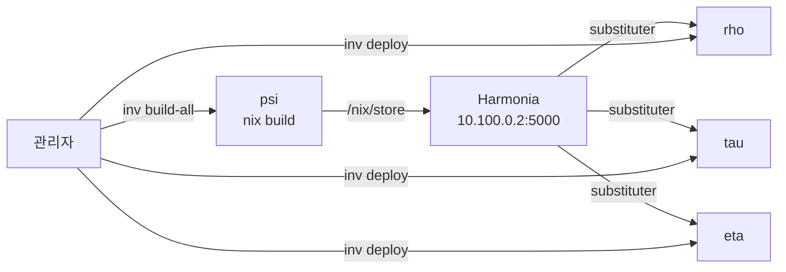

# 배포 & 변경 관리

## 수동 배포

```bash
# 단일 호스트
inv deploy --hosts psi

# 다중 호스트
inv deploy --hosts psi,rho,tau,eta
```

`inv deploy`는 SSH를 통해 원격 호스트에서 `nixos-rebuild switch`를 실행합니다.

## 자동 업그레이드

모든 호스트에 자동 업그레이드가 설정되어 있습니다:

- **소스**: `github:SBEE-lab/infra`
- **업그레이드 체크**: `system.autoUpgrade`가 주기적으로 최신 커밋을 가져와 `nixos-rebuild switch` 실행
- **재부팅 체크**: 매월 마지막 토요일에 `auto-reboot` 서비스가 커널 업데이트 여부를 확인
- **재부팅**: 커널이 변경된 경우에만 24시간 후 자동 재부팅 (`shutdown -r +1440`)
- **지터**: ±20분 (호스트별 재부팅 시점 분산)

## 사전 빌드 (Harmonia 캐시)

배포 전 psi에서 미리 빌드하면 다른 호스트의 배포 시간을 크게 줄일 수 있습니다.



**동작 원리**: psi에서 `nix build`를 실행하면 결과물이 `/nix/store`에 저장됩니다. Harmonia 데몬이 이 `/nix/store`를 네트워크로 제공하므로, 다른 호스트(rho, tau, eta)가 배포 시 psi의 캐시에서 빌드 결과를 바로 가져옵니다.

```bash
# psi에서 전체 호스트 사전 빌드 (권장)
inv build-all --builder psi --concurrent 24

# 이후 배포 — 이미 빌드된 결과를 캐시에서 가져오므로 빠름
inv deploy --hosts rho,tau,eta
```

Buildbot도 메인 브랜치 커밋 시 자동으로 빌드를 수행하지만, 메인 브랜치에는 검증된 코드만 올려야 합니다. 일반적인 배포 흐름은 **수동 사전 빌드 → 배포**입니다.

> **Harmonia 캐시**: psi(`wg-admin:5000`)에서 제공됩니다. 다른 호스트는 `http://10.100.0.2:5000`을 substituter로 사용하도록 설정되어 있습니다.

## 배포 전 확인

```bash
# 로컬에서 빌드 테스트
nix build .#nixosConfigurations.psi.config.system.build.toplevel

# 전체 호스트 빌드 (psi에서 원격)
inv build-all --builder psi --concurrent 24
```

## 주요 invoke 명령어

| 명령어 | 설명 |
|--------|------|
| `inv deploy --hosts <host>` | 원격 배포 |
| `inv build-all` | 전체 호스트 빌드 |
| `inv add-server --hostname <name>` | 새 서버 추가 |
| `inv generate-ssh-cert <host>` | SSH 인증서 생성 |
| `inv generate-wireguard-key --hostname <host>` | WireGuard 키 생성 |
| `inv generate-password --user <name>` | 비밀번호 해시 생성 |
| `inv expired-accounts` | 만료 계정 확인 |
