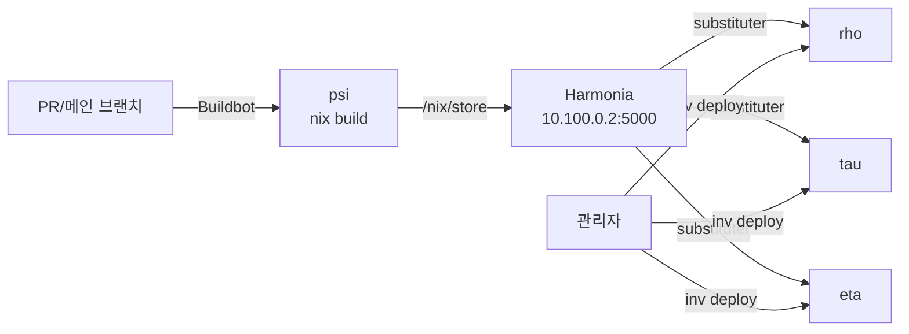

# 배포 & 변경 관리

## 수동 배포

```bash
# 단일 호스트
inv deploy --hosts psi

# 다중 호스트
inv deploy --hosts psi,rho,tau,eta
```

`inv deploy`는 SSH를 통해 원격 호스트에서 `nixos-rebuild switch`를 실행합니다.

## 자동 업그레이드

모든 호스트에 자동 업그레이드가 설정되어 있습니다:

- **소스**: `github:SBEE-lab/infra`
- **업그레이드 체크**: `system.autoUpgrade`가 주기적으로 최신 커밋을 가져와 `nixos-rebuild switch` 실행
- **재부팅 체크**: 매월 마지막 토요일에 `auto-reboot` 서비스가 커널 업데이트 여부를 확인
- **재부팅**: 커널이 변경된 경우에만 24시간 후 자동 재부팅 (`shutdown -r +1440`)
- **지터**: ±20분 (호스트별 재부팅 시점 분산)

## 사전 빌드 (Buildbot/Harmonia 캐시)

PR과 메인 브랜치 변경은 Buildbot이 빌드합니다. 빌드 결과는 psi의 `/nix/store`에 남고, Harmonia가 이 store를 내부 캐시로 제공합니다. 다른 호스트는 배포 시 `http://10.100.0.2:5000` substituter에서 이미 빌드된 결과를 가져옵니다.


```mermaid
flowchart LR
  pr["PR/메인 브랜치"] -- "Buildbot" --> psi["psi<br/>nix build"]
  psi -- "/nix/store" --> harmonia["Harmonia<br/>10.100.0.2:5000"]
  harmonia -- "substituter" --> rho["rho"]
  harmonia -- "substituter" --> tau["tau"]
  harmonia -- "substituter" --> eta["eta"]
  admin["관리자"] -- "inv deploy" --> rho & tau & eta
```

일반적인 배포 흐름은 **PR에서 Buildbot 통과 확인 → merge → 배포**입니다.

## 배포 전 확인

```bash
# 로컬에서 단일 호스트 빌드 테스트
nix build .#nixosConfigurations.psi.config.system.build.toplevel
```

## 주요 invoke 명령어

| 명령어 | 설명 |
|--------|------|
| `inv deploy --hosts <host>` | 원격 배포 |
| `inv add-server --hostname <name>` | 새 서버 추가 |
| `inv generate-ssh-cert <host>` | SSH 인증서 생성 |
| `inv generate-wireguard-key --hostname <host>` | WireGuard 키 생성 |
| `inv generate-password --user <name>` | 비밀번호 해시 생성 |
| `inv expired-accounts` | 만료 계정 확인 |
