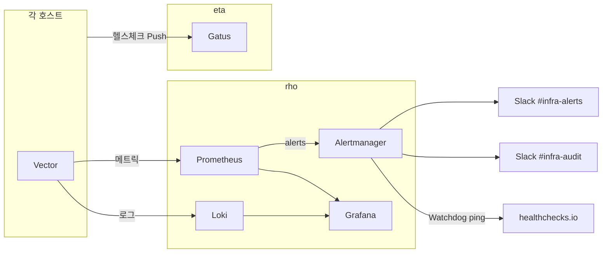

# 모니터링

## 대시보드

- **Grafana**: `https://logging.sjanglab.org` (익명 Viewer 접근 가능, wg-admin 경유)
  - `SjangLab Infrastructure` (홈): 현재 건강 상태와 감사 요약 카운트
  - `SjangLab Hosts`: 호스트 리소스, 메트릭 freshness, Headscale 노드 상태
  - `SjangLab Apps`: Gatus 앱 smoke 상태와 앱 인증/거부 흐름
  - `SjangLab Jobs`: db-sync 및 batch/sync/backup 상태
  - `SjangLab Access & Audit`: SSH bastion, Authentik, Headscale 감사 드릴다운
  - `SjangLab AI Resources`: AI 서비스 smoke, psi 리소스, 데이터 동기화 상태
- **Gatus**: `https://status.sjanglab.org` (tailnet 내부 공개 상태 페이지)

## 스택 구성



### Vector (로그/메트릭 수집)

모든 호스트에서 실행됩니다:

| 수집 대상 | 전송처 | 주기 |
|---------|--------|------|
| sshd 로그 | Loki (rho:3100) | 실시간 |
| SSH bastion forward 매핑 | Loki (rho:3100) | 실시간 |
| auditd 로그 | Loki (rho:3100) | 실시간 |
| Authentik 감사 이벤트 (eta) | Loki (rho:3100) | 실시간 |
| Headscale 컨트롤플레인 이벤트 (eta) | Loki (rho:3100) | 실시간 |
| Headscale 노드 인벤토리 스냅샷 (eta) | Loki (rho:3100) | 300초 |
| 호스트 메트릭 | Prometheus (rho:9090) | 60초 |
| psi job freshness/status snapshot | Loki (rho:3100) | 60초 |

eta는 SSH 인증 로그와 같은 PID의 outbound socket을 관찰해 `ssh_bastion` 로그를 생성하고 Loki로 직접 전송합니다. ProxyJump 때문에 대상 호스트가 eta의 내부 IP만 보더라도 실제 접속원 IP, bastion 사용자, 대상 호스트를 함께 조회할 수 있습니다.

```logql
{log_type="ssh_bastion", event="bastion_forward"}
```

대상 호스트의 SSH 로그와 맞출 때는 `target_host`, `bastion_user`, 시간대, `bastion_local_port`를 함께 봅니다. 대상 호스트 sshd 로그의 `source_port`가 eta에서 기록한 `bastion_local_port`입니다.

### Job freshness (psi, rho)

psi는 `db-sync-*.service`, protected data backup, Nixbot PostgreSQL backup 상태를 60초마다 snapshot으로 기록합니다. rho는 PostgreSQL backup과 delayed mirror units 상태를 같은 형식으로 기록합니다 (`log_type="systemd_status"`, `event="job_snapshot"`). 각 행은 `health=OK|WARN|FAIL`, `health_reason`, `last_success_age_seconds`, `next_due_seconds`, `max_success_age_seconds`를 포함합니다. `FAIL`은 systemd 실패/비정상 exit, `WARN`은 성공 기록이 없거나 마지막 성공이 freshness 한계를 넘은 상태입니다.

### 접근 감사 (Authentik / Headscale)

eta의 Vector가 journald에서 수집해 이벤트를 분류합니다 (`modules/authentik/audit.nix`, `modules/headscale/audit.nix`):

- **Authentik** (`log_type="authentik"`): `login`, `login_failed`, `logout`, `app_authorize`(브라우저 앱 인가), `admin_change`, `policy_error`, `forward_auth_deny`
- **Headscale** (`log_type="headscale"`): `node_register`, `node_expire`, `preauth_key`, `oidc_denied`, `error` — 컨트롤플레인/멤버십 감사이며 tailnet 데이터플레인 트래픽은 관측 대상이 아닙니다
- **Headscale 노드 인벤토리** (`log_type="headscale_nodes"`): 5분 주기 스냅샷 (`event="node_snapshot"`)과 집계 행(`event="nodes_summary"`)으로 node, user, IP, tags, online, health, health_reason, last_seen_seconds, expiry_seconds를 기록합니다

```logql
{log_type="authentik", event="login_failed"}
{log_type="headscale", event="node_register"}
```

**레이블 정책**: Loki 레이블은 bounded 값(`host`, `log_type`, `event`)만 사용합니다. `user`, `source_ip`, `app`, `node` 등 고카디널리티 값은 JSON 필드로만 저장하고 LogQL `| json`으로 조회합니다. 시크릿/쿠키/인증 헤더는 수집하지 않습니다. Authentik `login`/`app_authorize` 이벤트의 `client_ip`는 실제 클라이언트 IP로 보존하지만, `forward_auth_deny`의 `remote`는 내부 프록시 주소일 수 있어 `proxy_remote` 필드로만 기록합니다.

### Prometheus (rho)

- 리텐션: 30일
- Remote write receiver 활성화
- Scrape jobs:
  - `vector`: rho Vector exporter
  - `blackbox_exporter`: eta blackbox exporter 자체 health
  - `alertmanager`: rho Alertmanager health (Alertmanager SOPS keys가 있을 때)
  - `blackbox_http`: eta vantage public HTTPS probes (`auth`, `hs`, `n8n`)
  - `blackbox_tailnet_http`: eta vantage wg-admin HTTPS probes with Host/SNI override for tailnet-only apps (`n8n-ui`, `grafana`, `nextcloud`, etc.)
  - `blackbox_tcp`: eta vantage TCP probe for Upterm
  - `blackbox_icmp`: eta vantage ICMP probe for wg-admin host reachability
  - `nvidia-gpu`: psi GPU exporter
- Alert rules: 호스트 메트릭 freshness, 디스크 부족/심각 부족, 메모리 부족, 높은 CPU, generic scrape target down, Gatus non-app heartbeat down, blackbox exporter down, blackbox probe failed, GPU exporter down, Watchdog dead-man
- Alert delivery: Alertmanager routes operational alerts to Slack `#infra-alerts`, audit alerts to `#infra-audit`, and the always-firing `Watchdog` to healthchecks.io. healthchecks.io then notifies Slack `#infra-alerts` through its integration if the Watchdog stops pinging.
- Alert bridge: Cloudflare Worker/D1 bridge is deployed separately and has its own healthchecks.io heartbeat. Alertmanager/healthchecks.io traffic still uses legacy Slack paths until explicit cutover.

### Alert response runbook

공통 절차:

1. Slack alert의 `host`, `service`, `alert_category`, `dashboard_url`, `runbook_url`를 확인합니다.
1. Grafana dashboard에서 같은 시간대의 metrics/logs를 확인합니다.
1. 서비스 단위 장애면 `systemctl status <unit>`와 `journalctl -u <unit> -e`를 먼저 확인합니다.
1. 사용자 영향이 있으면 `#infra-alerts`에 조사 시작/완료 시간을 남깁니다.
1. 원인을 모르면 silence하지 않습니다. 노이즈성 반복일 때만 만료 시간이 있는 silence를 설정합니다.

대표 alert별 1차 확인:

| Alert | 1차 확인 | 다음 조치 |
|-------|----------|----------|
| `HostMetricsMissing` | `systemctl status vector`, 네트워크, rho Prometheus target | Vector 재시작 또는 wg-admin 연결 복구 |
| `DiskSpaceLow` / `DiskSpaceCritical` | `df -h`, `du -xhd1 <mount>` | GC, 오래된 workspace 정리, 백업 저장소 용량 증설 |
| `GatusEndpointDown` | Gatus endpoint와 해당 push unit journal | 서비스 health push unit 재시작 |
| `BlackboxProbeFailed` | eta blackbox exporter, DNS, nginx 인증서 | ACME/프록시/방화벽 확인 |
| `BackupJobFailed` / `BackupJobStale` | `log_type="systemd_status"`, 대상 timer/service | 백업 unit 수정 후 수동 실행 |
| `AuditJobFailed` | `log_type="systemd_status"`, 대상 audit timer/service | 감사 수집 unit 복구 후 누락 구간 확인 |
| `Watchdog` 미수신 | Alertmanager, healthchecks.io ping URL, 네트워크 | Alertmanager 복구. bridge 장애와 분리 확인 |

감사 alert는 `#infra-audit`에 도착합니다. 사용자명, source IP, app/node 정보를 기록하고 계정 탈취 가능성이 있으면 Authentik 계정 비활성화와 Headscale ACL apply를 우선합니다.

### Alert delivery bootstrap

Slack 앱 설정은 `modules/monitoring/alerts/slack-app/slack-app-manifest.json`이 source of truth입니다. `modules/monitoring/alerts/slack-app` 디렉터리에서 direnv를 허용하면 Slack CLI가 포함된 `slack-deploy` shell에 들어갑니다:

```bash
cd modules/monitoring/alerts/slack-app
direnv allow
```

운영 원칙:

- Slack app/bot/scope: manifest JSON으로 선언하고 Slack CLI가 `.slack/hooks.json`을 통해 app을 생성/업데이트합니다.
- Slack app install: Slack CLI로 app을 install하고, 필요하면 admin OAuth 승인을 완료합니다.
- Slack channel: workspace resource라 수동으로 준비합니다 (`#infra-alerts`, `#infra-audit`).
- Slack bot token: external alert bridge가 `chat:write`로 메시지를 생성/수정할 때 사용합니다. CI에 넣지 않습니다.
- Slack webhook URL: bridge migration 동안만 유지되는 channel-bound secret입니다.
- healthchecks.io checks: `terraform/healthchecksio`에서 `rho-alertmanager-watchdog`와 `infra-alert-bridge-heartbeat`를 관리하고, sensitive `ping_url` output을 SOPS에 수동 저장합니다. healthchecks.io Slack integration은 bridge migration 동안 유지합니다.
- Alert bridge: `terraform/alert-bridge`가 Cloudflare Worker/D1/secret binding/cron을 관리합니다. D1 migration은 Worker 배포 후 수동으로 실행합니다.
- CI: manifest JSON syntax 검증만 합니다. Slack token이나 webhook URL을 CI에 넣지 않습니다.

필요한 SOPS keys:

```yaml
alertmanager-slack-infra-alerts-webhook: ENC[...]
alertmanager-slack-infra-audit-webhook: ENC[...]
alertmanager-healthchecks-ping-url: ENC[...]
```

자세한 Slack bootstrap/drift check 절차는 `modules/monitoring/alerts/slack-app/README.md`를 봅니다.

### Alert bridge cutover

현재 운영 경로는 legacy Slack incoming webhook입니다. Bridge로 전환할 때만 아래 절차를 진행합니다.

1. `terraform/alert-bridge` apply 완료 확인
1. `packages/infra-alert-bridge`에서 D1 migration 실행
1. Worker `GET /healthz`와 cron heartbeat 확인
1. Alertmanager receiver를 bridge `POST /alertmanager`로 변경하고 bearer token 설정
1. healthchecks.io webhook integration을 bridge `POST /healthchecks`로 변경하고 bearer token 설정
1. `#infra-alerts`, `#infra-audit`에 firing/resolved/update 메시지가 정상 생성되는지 확인
1. rollback window 동안 legacy Slack webhook secret 유지
1. 안정화 후 `incoming-webhook` Slack scope와 webhook SOPS key 제거

Rollback은 Alertmanager receiver와 healthchecks.io integration을 legacy Slack 경로로 되돌리는 방식으로 수행합니다. Worker 장애가 Watchdog ping 자체를 막지 않도록 `rho-alertmanager-watchdog`은 healthchecks.io로 직접 ping합니다.

### Loki (rho)

- 리텐션: 기본 7일, 감사 스트림(`log_type=~"ssh|ssh_bastion|audit|authentik|headscale"`)은 90일
  - `headscale_nodes` 스냅샷은 반복 상태 데이터라 기본 7일 적용
- 스토리지: 로컬 파일시스템 (`/var/lib/loki`)

### Gatus (eta)

- Pull 방식: eta에서 직접 접근 가능한 서비스 (Authentik, Headscale, Upterm 등)
- Push 방식: 내부 서비스가 로컬/사용자 경로를 확인한 뒤 상태 보고
- 저장소: SQLite (`/var/lib/gatus/gatus.sqlite`)로 재시작 후 uptime 유지
- External endpoint heartbeat: 15분 동안 push가 없으면 실패 처리
- 그룹: `apps`, `ai`, `ci`, `monitoring`, `platform`, `storage`
- 기본 정렬: group 기준
- 알림: 직접 전송 없음. Prometheus가 Gatus metrics를 평가하고, Alertmanager SOPS keys가 있을 때 Alertmanager가 Slack으로 라우팅합니다.
