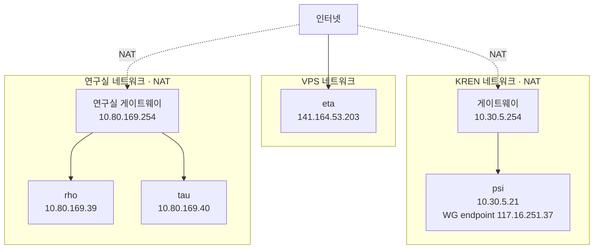
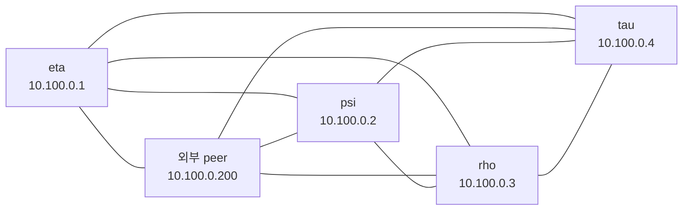

# 논리 네트워크 토폴로지

> `inv update-network-topology`으로 NixOS host inventory와 WireGuard peer 설정에서 자동 생성합니다.

## Underlay

## wg-admin overlay

## 평가된 host inventory

| 호스트 | 물리 IPv4 | 게이트웨이 | wg-admin | WireGuard endpoint | 태그 |
|--------|-----------|------------|----------|--------------------|------|
| eta | 141.164.53.203 | 141.164.52.1 | 10.100.0.1 | — | `public-ip`, `vps-network` |
| psi | 10.30.5.21 | 10.30.5.254 | 10.100.0.2 | 117.16.251.37 | `nat-behind`, `kren-dns` |
| rho | 10.80.169.39 | 10.80.169.254 | 10.100.0.3 | — | `nat-behind`, `lab-network`, `kren-dns` |
| tau | 10.80.169.40 | 10.80.169.254 | 10.100.0.4 | — | `nat-behind`, `lab-network`, `kren-dns` |
