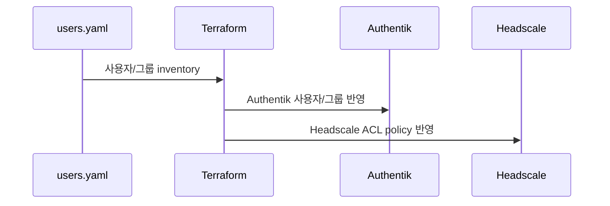

# 네트워크

NixOS host inventory와 WireGuard peer 설정을 평가한 최신 구성은 [자동 생성 논리 네트워크 토폴로지](network-topology.md)에서 확인합니다. 설정 변경 후 `inv update-network-topology`으로 갱신합니다.

## 논리 네트워크 개요

Underlay host grouping, NAT gateway, `wg-admin` peer 관계와 평가된 주소는 [자동 생성 논리 네트워크 토폴로지](network-topology.md)를 source of truth로 사용합니다. 이 문서는 각 레이어의 운영 정책을 설명합니다.

| 레이어 | 기술 | 용도 | 대역 |
|--------|------|------|------|
| Underlay | VPS, KREN, 연구실 NAT | 호스트의 물리 IPv4 연결 | 네트워크별 상이 |
| WireGuard | `wg-admin` | 인프라 관리 (SSH, DB, 모니터링) | `10.100.0.0/24` |
| Headscale | Tailscale 호환 | 사용자 서비스 접근 | `100.64.0.0/10` |

## WireGuard (`wg-admin`)

인프라 관리용 메시 VPN입니다. SSH, DB, 모니터링 트래픽이 이 네트워크를 통합니다.

- 인터페이스: `wg-admin`
- 포트: `51820/UDP`
- 대역: `10.100.0.0/24`
- PersistentKeepalive: 25초

rho와 tau는 공개 WireGuard endpoint가 없으며, 공인 eta 또는 KREN NAT로 공개된 psi endpoint에 먼저 연결합니다.

## Headscale (사용자 VPN)

사용자가 서비스에 접근하기 위한 Tailscale 호환 VPN입니다.

- 제어 서버: `https://hs.sjanglab.org`
- IPv4: `100.64.0.0/10`
- Magic DNS: `sbee.lab`
- Split DNS: `sjanglab.org` 쿼리를 내부 DNS로 라우팅

### ACL 그룹 { #acl-groups }

Terraform이 `terraform/authentik/users.yaml`의 그룹 membership으로 생성합니다.

| 그룹 | 접근 태그 |
|------|----------|
| `sjanglab-admins` | `tag:ai`, `tag:apps`, `tag:monitoring` |
| `sjanglab-researchers` | `tag:ai`, `tag:apps` |
| `sjanglab-students` | `tag:apps` |

### ACL 태그 소유권

| 태그 | 소유 그룹 | 설명 |
|------|----------|------|
| `tag:server` | `sjanglab-admins` | 서버 노드 |
| `tag:ai` | `sjanglab-admins` | AI/GPU 서비스 (Docling, TEI, MULTI-evolve†) |
| `tag:apps` | `sjanglab-admins` | 앱 서비스 (Nextcloud, n8n, Vaultwarden) |
| `tag:monitoring` | `sjanglab-admins` | 모니터링 (Grafana) |

> †MULTI-evolve는 Streamlit 앱이지만 psi에 배치되어 네트워크 수준에서는 `tag:ai`로 보호됩니다. n8n과 MULTI-evolve는 Authentik Forward Auth에서 관리자/연구원만 허용합니다.

### ACL 정책 관리 { #acl-policy }

Headscale ACL policy는 `terraform/headscale`의 `headscale_policy.tailnet` 리소스가 관리합니다. 사용자 membership은 SOPS로 암호화한 `terraform/authentik/users.yaml`을 source of truth로 사용하고, Authentik 사용자/그룹과 Headscale ACL policy가 같은 inventory에서 생성됩니다. Headscale user는 Terraform에서 만들지 않고, Authentik 그룹 인가를 통과한 첫 OIDC 로그인 때 생성됩니다.

```mermaid
sequenceDiagram
  participant U as users.yaml
  participant T as Terraform
  participant A as Authentik
  participant H as Headscale

  U->>T: 사용자/그룹 inventory
  T->>A: Authentik 사용자/그룹 반영
  T->>H: Headscale ACL policy 반영
```

Headscale은 `policy.mode = "database"`로 동작합니다. ACL 변경 후 즉시 반영하려면 `terraform/headscale`에서 `terragrunt apply`를 실행합니다.

## 방화벽 정책

### 공통

- `wg-admin` 인터페이스: 신뢰 (모든 포트 허용)
- WireGuard: `51820/UDP`

### 호스트별

| 호스트 | 외부 개방 포트 | wg-admin 개방 포트 |
|--------|--------------|-------------------|
| eta | 80, 443, 10022 (공개키 SSH), 2323 (Upterm relay) | 10022, 8000 (Vaultwarden), 8081 (Gatus) |
| psi | — | 80/443 (Nixbot upstream), 10022, 5751 (niks3 API), 5432 (Nixbot/niks3 PostgreSQL), 9201/9202 (TEI metrics) |
| rho | — | 10022, 5432 (PostgreSQL), 3000 (Grafana) |
| tau | — | 10022, 5678 (n8n 웹훅) |

## ACME 인증서

대부분의 TLS 인증서는 eta에서 Cloudflare DNS 챌린지로 발급됩니다. Nixbot(`nixbot.sjanglab.org`) 공개 인증서는 eta에서 발급되고, psi의 Nixbot nginx도 wg-admin upstream용 인증서를 유지합니다. 다른 호스트(rho, tau, psi)의 나머지 인증서는 `acme-sync` 사용자를 통해 rsync로 동기화됩니다.
