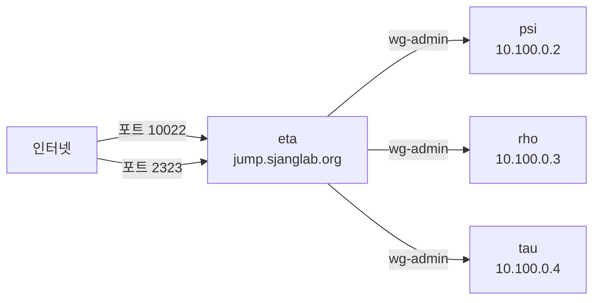
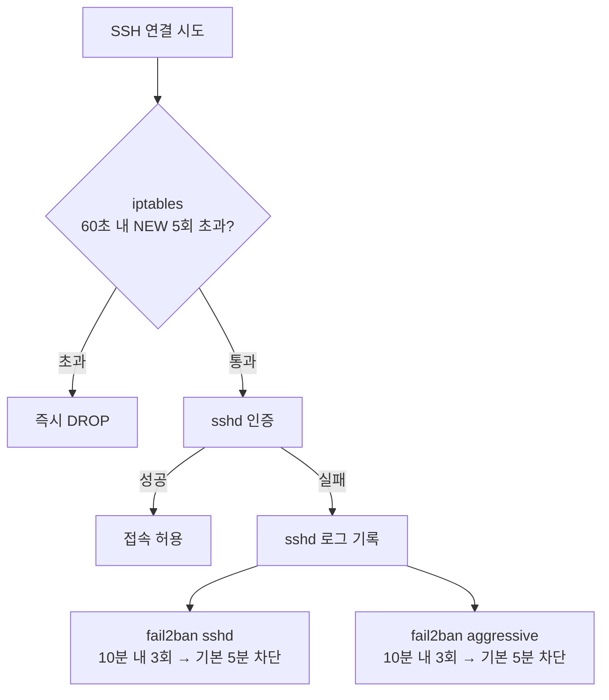
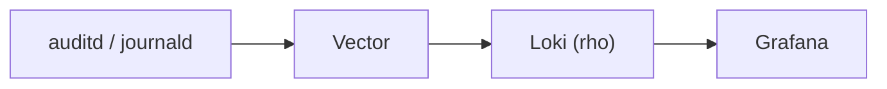

# 보안

인프라 전반의 보안 정책과 구현 현황을 정리합니다.

## 네트워크 보안

### 방화벽 정책

인터페이스별 화이트리스트 방식으로 포트를 관리합니다.

| 인터페이스 | 용도 | 열린 포트 |
|-----------|------|----------|
| eta eth0 (퍼블릭) | public edge | TCP 80, 443, 10022, 2323; UDP 51820 |
| psi eth0 (퍼블릭) | WireGuard/Tailscale transport | UDP 51820, 41641; public TCP 없음 |
| rho/tau eth0 (랩 내부 NAT) | LAN 및 VPN transport | tau TCP 80, 443; UDP 51820, 41641 |
| wg-admin (WireGuard) | 신뢰된 호스트 간 관리·서비스 트래픽 | 모든 포트 |
| tailscale0 (Headscale) | 사용자 서비스 | 서비스별 (주로 80, 443) |

기본 정책은 **deny all**입니다. 단, `wg-admin`은 `networking.firewall.trustedInterfaces`에 등록되어 호스트 방화벽이 모든 트래픽을 허용합니다. wg-admin 서비스는 listen address와 WireGuard peer 관리로 노출 범위를 제한합니다. 퍼블릭·Headscale 인터페이스는 각 서비스 모듈이 필요한 포트만 개방합니다.

### Bastion 아키텍처

eta가 유일한 인터넷 노출 SSH 호스트입니다. Upterm relay도 eta의 `2323/tcp`에서만 외부에 노출됩니다. 다른 호스트(psi, rho, tau)는 `wg-admin` 인터페이스에서만 SSH를 수신합니다.


```mermaid
flowchart LR
  inet["인터넷"] -- "포트 10022" --> eta["eta<br/>jump.sjanglab.org"]
  inet -- "포트 2323" --> eta
  eta -- "wg-admin" --> psi["psi<br/>10.100.0.2"]
  eta -- "wg-admin" --> rho["rho<br/>10.100.0.3"]
  eta -- "wg-admin" --> tau["tau<br/>10.100.0.4"]
```

### SSH 속도 제한

eta에 적용되는 방어 계층:


```mermaid
flowchart TD
  conn["SSH 연결 시도"] --> ipt{"iptables<br/>60초 내 NEW 5회 초과?"}
  ipt -- "초과" --> drop["즉시 DROP"]
  ipt -- "통과" --> sshd["sshd 인증"]
  sshd -- "성공" --> ok["접속 허용"]
  sshd -- "실패" --> log["sshd 로그 기록"]
  log --> f1["fail2ban sshd<br/>10분 내 3회 → 기본 5분 차단"]
  log --> f2["fail2ban aggressive<br/>10분 내 3회 → 기본 5분 차단"]
```

iptables(연결 빈도)와 fail2ban(인증 실패 로그)은 **독립적인 병렬 계층**입니다. iptables는 TCP 연결 시점에 즉시 판단하고, fail2ban은 sshd 로그를 감시하여 사후 차단합니다.

| 계층 | 조건 | 차단 |
|------|------|------|
| iptables | 60초 내 NEW 연결 5회 초과 | 즉시 DROP |
| fail2ban `sshd` | 10분 내 일반 SSH 인증 실패 3회 | 기본 5분 |
| fail2ban `sshd-aggressive` | 10분 내 aggressive 필터 일치 3회 | 기본 5분 |

재차 차단되는 IP는 전체 jail 이력을 기준으로 차단 시간이 지수 증가하며 최대 7일까지 늘어납니다. 화이트리스트는 `10.0.0.0/8` 내부 네트워크와 다른 호스트의 공인 IP입니다.

### WireGuard VPN 분리

| 네트워크 | 대역 | 용도 |
|---------|------|------|
| wg-admin | `10.100.0.0/24` | 인프라 관리 (SSH, DB, 내부 서비스) |
| Headscale | `100.64.0.0/10` | 사용자 서비스 접근 (웹 서비스) |

두 네트워크는 독립적입니다. wg-admin peer key는 인프라 호스트와 승인된 관리자 기기에만 배포합니다. 일반 사용자는 wg-admin peer가 되지 않으며, SSH가 허용된 사용자는 eta bastion을 통해 대상 호스트의 wg-admin 주소로 접속합니다.

## 계정 및 권한 정책

### 사용자 계층

| 역할 | NixOS 그룹 | sudo | Docker | SSH 호스트 | 만료 |
|------|-----------|------|--------|-----------|------|
| 관리자 | `wheel`, `docker`, `admin`, `input` | O | O | 전체 | — |
| 연구원 | `docker`, `researcher`, `input` | X | O | 지정 호스트 | 필수 |
| 학생 | `docker`, `student`, `input` | X | O | 지정 호스트 | 필수 |

### Root 접근 정책

| 접근 경로 | 허용 |
|----------|------|
| SSH (인터넷) | **차단** (`PermitRootLogin no`) |
| SSH (wg-admin, 10.100.0.0/24) | 공개키만 (`prohibit-password`) |
| sudo (로컬) | `wheel` 그룹만 |

root의 `authorized_keys`에는 관리자 키만 등록됩니다 (`modules/users/admins.nix`).

### 시스템 계정

서비스별로 전용 시스템 계정이 분리되어 있습니다.

| 계정 | 서비스 | 유형 | 특기 사항 |
|------|--------|------|----------|
| `nixbot` | Nixbot CI | isSystemUser | `nix.settings.extra-allowed-users` |
| `harmonia` | Nix 바이너리 캐시 | isSystemUser | `nix.settings.allowed-users` |
| `rustfs` | RustFS S3 저장소 | isSystemUser | `/srv/rustfs/data` 전용 |
| `acme-sync-*` | TLS 인증서 동기화 | — | rsync 전용, 제한된 경로 |
| `postgres` | PostgreSQL | isSystemUser | DB 전용 |
| `nextcloud` | Nextcloud | isSystemUser | — |

### Nix 권한

| 설정 | 대상 | 의미 |
|------|------|------|
| `trusted-users` | 관리자 | 캐시 서명, 임의 derivation 빌드 가능 |
| `allowed-users` | nixbot, harmonia | Nix store 사용 허용 |

## SSH 보안

### 알고리즘 정책

| 항목 | 허용 알고리즘 |
|------|-------------|
| Ciphers | `chacha20-poly1305`, `aes256-gcm`, `aes128-gcm` |
| KexAlgorithms | `curve25519-sha256`, `diffie-hellman-group16-sha512`, `diffie-hellman-group18-sha512` |
| MACs | `hmac-sha2-512-etm`, `hmac-sha2-256-etm` |

### 세션 정책

| 설정 | 값 |
|------|-----|
| 인증 방식 | 공개키만 (비밀번호 비활성화) |
| 키 알고리즘 | Ed25519 권장 |
| MaxAuthTries | 3 |
| LoginGraceTime | 30초 |
| ClientAliveInterval | 1200초 (20분) |
| X11Forwarding | 비활성화 |
| Compression | 비활성화 |

### SSH CA 인증서

호스트 키는 CA로 서명되어 있어 `known_hosts`에 CA 공개키만 등록하면 모든 호스트를 신뢰할 수 있습니다.

```
@cert-authority *.sjanglab.org ssh-ed25519 AAAAC3...
```

설정 위치: `modules/sshd/certs/`

## 비밀 관리

### sops-nix + age

모든 비밀은 age(Curve25519) 암호화로 보호됩니다. 호스트별 age 키와 관리자 키가 각 비밀 파일을 복호화할 수 있습니다.

| 비밀 파일 | 접근 가능 키 | 내용 |
|----------|------------|------|
| `hosts/<host>.yaml` | 해당 호스트 + admin | root 비밀번호 해시, WireGuard 키 |
| `hosts/rho.yaml`, `hosts/tau.yaml` | 해당 호스트 | RustFS root credential, host-local backup passwords, PostgreSQL 사용자/복제 암호 |
| `modules/acme/secrets.yaml` | eta, psi, tau | Cloudflare API 인증 |
| `modules/buildbot/secrets.yaml` | psi | Nixbot GitHub App/OAuth 시크릿 |
| `modules/authentik/secrets.yaml` | eta | OIDC 클라이언트 시크릿 |

### 비밀 편집

```bash
# 비밀 편집 (age 키 자동 사용)
sops hosts/psi.yaml

# 키 교체 후 재암호화
sops updatekeys hosts/psi.yaml
```

자세한 내용은 [비밀 관리](secrets-management.md)를 참조합니다.

## TLS 인증서

대부분의 도메인은 eta에서 Let's Encrypt ACME + Cloudflare DNS 챌린지로 인증서를 발급합니다. Nixbot 공개 ingress는 eta에서 인증서를 발급하고, psi의 Nixbot 스택도 내부 nginx용 인증서를 유지합니다. 다른 호스트에서 사용하는 인증서는 `acme-sync` 서비스가 rsync로 동기화하고, 대상 호스트의 systemd path unit이 파일 변경을 감지하여 nginx를 자동 리로드합니다.

| 도메인 | 발급 호스트 | 사용 호스트 |
|--------|-----------|-----------|
| `auth.sjanglab.org` | eta | eta |
| `vault.sjanglab.org` | eta | eta |
| `hs.sjanglab.org` | eta | eta |
| `cloud.sjanglab.org` | eta | tau (동기화) |
| `n8n.sjanglab.org` | eta | tau (동기화) |
| `docling.sjanglab.org` | eta | psi (동기화) |
| `tei.sjanglab.org` | eta | psi (동기화) |
| `multievolve.sjanglab.org` | eta | psi (동기화) |
| `buildbot.sjanglab.org` | eta, psi | eta (public edge), psi (service stack) |
| `upterm.sjanglab.org` | eta | eta |

인증서 동기화: eta에서 발급 → `acme-sync` 서비스가 rsync로 대상 호스트에 전송 → systemd path unit이 변경 감지 → nginx 자동 리로드. Nixbot은 eta 공개 edge와 psi 서비스 스택 양쪽에서 인증서를 발급합니다.

## 데이터 보안

### PostgreSQL

| 설정 | 값 |
|------|-----|
| 바인드 주소 | wg-admin IP만 |
| 인증 방식 | SCRAM-SHA-256 (원격), Peer (로컬) |
| 복제 | WAL 스트리밍 (rho → tau) |
| 암호 관리 | sops 암호화 |

### RustFS S3 backup store

| 설정 | 값 |
|------|-----|
| API 바인드 | wg-admin IP만 (`:9100`) |
| console 바인드 | localhost only (`127.0.0.1:9101`) |
| 저장소 | `/srv/rustfs/data` |
| bucket state | `rustfs-bootstrap.service`가 S3 API로 생성/검증 |
| client 인증 | access key / secret key |

RustFS root credential은 bootstrap과 break-glass 용도로만 사용합니다. Backup job은 repo별 writer/pruner/reader/mirror credential과 IAM policy를 사용해야 합니다.

## 감사 및 모니터링

### auditd

Linux 감사 데몬으로 다음을 추적합니다:

| 추적 대상 | 파일 |
|----------|------|
| PAM 세션 | `/var/log/wtmp`, `/var/log/btmp`, `/var/run/utmp` |
| SSH 설정 변경 | `/etc/ssh/sshd_config` |

로그: `/var/log/audit/audit.log` (최대 8MB × 2)

### 로그 파이프라인


```mermaid
flowchart LR
  src["auditd / journald"] --> vec["Vector"]
  vec --> loki["Loki (rho)"]
  loki --> graf["Grafana"]
```

## 시스템 안정성

### 자동 업그레이드

| 설정 | 값 |
|------|-----|
| 소스 | `github:SBEE-lab/infra` |
| 업그레이드 | `system.autoUpgrade`가 주기적으로 최신 설정 적용 |
| 재부팅 체크 | 매월 마지막 토요일 (`auto-reboot` 서비스) |
| 재부팅 조건 | 커널 변경 시에만 24시간 후 자동 재부팅 |
| 지터 | ±20분 (호스트별 분산) |

### 서비스 복구

systemd가 서비스 실패 시 자동 재시작합니다. 모니터링은 Gatus(`status.sjanglab.org`)에서 헬스체크를 수행합니다.
