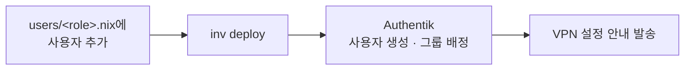

# 사용자 관리

사용자 관리는 크게 두 시스템으로 나뉩니다:

| 시스템 | 관리 대상 | 용도 |
|--------|----------|------|
| **NixOS** (`modules/users/`) | SSH 계정, 로컬 사용자 | 서버 접속, 파일시스템, Docker |
| **Authentik** (`auth.sjanglab.org`) | SSO 계정, 그룹 | 웹 서비스 인증, Headscale ACL |

두 시스템은 독립적으로 관리되며, Headscale ACL만 Authentik 그룹에서 15분마다 자동 동기화됩니다.

______________________________________________________________________

## Part 1: SSH 사용자 관리 (NixOS)

### 파일 구조

각 역할별 파일은 `let-in` 바인딩으로 `extraGroups`와 SSH 키를 정의합니다:

| 역할 | 파일 | extraGroups |
|------|------|-------------|
| 관리자 | `modules/users/admins.nix` | `wheel`, `docker`, `admin`, `input` |
| 연구원 | `modules/users/researchers.nix` | `docker`, `researcher`, `input` |
| 학생 | `modules/users/students.nix` | `docker`, `student`, `input` |

> **GPU 그룹**: GPU 접근을 위한 별도 그룹(`video`, `render`)은 사용하지 않습니다. 모든 GPU 작업은 Docker + NVIDIA Container Toolkit 또는 시스템에 설치된 CUDA를 통해 수행됩니다.

### 관리자 계정 (`admins.nix`)

관리자 계정은 다른 역할과 달리 추가 권한이 있습니다:

| 항목 | 설정 | 설명 |
|------|------|------|
| `extraGroups` | `wheel`, `docker`, `admin`, `input` | `wheel`로 sudo 사용 가능 |
| `allowedHosts` | `[ "all" ]` | 모든 호스트 SSH 접근 |
| `root` 키 | `openssh.authorizedKeys.keys` | 관리자 키를 root에도 등록 |
| `trusted-users` | `nix.settings.trusted-users` | Nix 원격 빌드, 캐시 서명 등 가능 |

관리자 추가 시 위 4가지를 모두 설정해야 합니다. `root` 키와 `trusted-users`는 `admins.nix` 내에서 직접 관리됩니다.

### 사용자 추가

파일 상단의 `let` 블록에 SSH 키를 정의하고, `in` 블록에 사용자를 추가합니다. 기존 사용자 아래, 주석 템플릿 위에 작성합니다:

```nix
let
  extraGroups = [
    "docker"
    "student"
    "input"
  ];

  jdoeKeys = [
    "ssh-ed25519 AAAA..."
  ];
in
{
  users.users = {
    # Jane Doe
    jdoe = {
      isNormalUser = true;
      home = "/home/jdoe";
      inherit extraGroups;
      shell = "/run/current-system/sw/bin/bash";
      uid = 3100;  # 고유 UID (학생/연구원: 3000+)
      allowedHosts = [ "rho" "tau" ];
      openssh.authorizedKeys.keys = jdoeKeys;
      expires = "2026-08-31";  # 학생 필수
    };
  };

  # ...주석 템플릿은 그대로 유지...
}
```

주의사항 (파일 상단 NOTICE):

- 주석 템플릿을 수정하지 말 것 (참고용으로만 사용)
- `extraGroups`, `users.deletedUsers`를 직접 수정하지 말 것
- 새 사용자는 주석 위에 작성할 것

### `allowedHosts` 동작

- `[ "all" ]` — 모든 호스트에 SSH 접근 가능 (관리자 기본값)
- `[ "rho" "tau" ]` — 지정 호스트만 접근 가능
- `[ ]` — 어디에도 접근 불가 (학생 기본값이므로 반드시 명시적 지정 필요)

`allowedHosts`에 포함되지 않은 호스트에서는 셸이 `nologin`으로 자동 강제됩니다.

### 배포

```bash
inv deploy --hosts <allowed-hosts>
```

### 사용자 삭제

1. 해당 `.nix` 파일에서 사용자 정의와 키 바인딩을 제거합니다
1. **같은 파일**의 `users.deletedUsers` 목록에 사용자명을 추가합니다

```nix
users.deletedUsers = [ "jdoe" ];
```

배포 시 `systemd.tmpfiles.rules`가 해당 사용자의 홈 디렉토리(`/home/jdoe`)를 자동으로 삭제합니다.

> `/project/<username>/` 등 홈 디렉토리 외 데이터는 자동 삭제되지 않습니다. 필요 시 수동으로 정리합니다.

### 만료 계정 확인

```bash
# 만료/만료 예정 계정 확인
inv expired-accounts

# GitHub 이슈 자동 생성 (만료된 계정)
inv expired-accounts-create-issues

# JSON 출력 (CI 자동화용)
inv expired-accounts-json
```

______________________________________________________________________

## Part 2: Authentik 사용자 관리 (SSO/ACL)

Authentik은 웹 서비스(Nextcloud, Vaultwarden, n8n)의 SSO 인증과 Headscale VPN 접근 제어를 담당합니다.

### 그룹 구조

| Authentik 그룹 | Headscale ACL 접근 | 서비스 |
|----------------|-------------------|--------|
| `sjanglab-admins` | `tag:ai` + `tag:apps` + `tag:monitoring` | 전체 |
| `sjanglab-researchers` | `tag:ai` + `tag:apps` | Nextcloud, Vaultwarden, Ollama, Docling |
| `sjanglab-students` | `tag:apps` | Nextcloud, Vaultwarden |

> Vaultwarden은 공개 서비스(VPN 불필요)이므로 Headscale ACL과 무관하게 Authentik 계정만으로 접근 가능합니다.

### 사용자 추가

1. `https://auth.sjanglab.org/if/admin/` 접속
1. **Directory → Users** 에서 사용자를 생성하거나 초대합니다
1. **Directory → Groups** 에서 해당 그룹에 사용자를 추가합니다

### ACL 동기화

Authentik 그룹 변경은 Headscale ACL에 자동 반영됩니다:

1. systemd 타이머가 15분마다 `headscale-acl-sync` 서비스를 실행
1. Authentik API에서 `sjanglab-*` 그룹의 멤버십을 조회
1. 정적 ACL 규칙(`acl-rules.nix`)과 동적 그룹 정보를 병합하여 `policy.json` 생성
1. Headscale이 inotify로 파일 변경을 감지하여 자동 리로드

즉시 동기화가 필요하면:

```bash
ssh -p 10022 root@eta systemctl start headscale-acl-sync.service
```

### 사용자 비활성화

1. Authentik 관리 UI에서 사용자를 **비활성화** (삭제가 아닌 비활성화)
1. 그룹에서 제거합니다
1. 다음 ACL 동기화 시 Headscale 접근이 차단됩니다

______________________________________________________________________

## 온보딩 워크플로우



| 단계 | 시스템 | 작업 |
|------|--------|------|
| 1 | NixOS | `modules/users/<role>.nix`에 사용자 추가 |
| 2 | NixOS | `inv deploy --hosts <hosts>` |
| 3 | Authentik | 사용자 생성, 그룹 배정 |
| 4 | — | 사용자에게 VPN 설정 안내 발송 |

## 오프보딩 워크플로우


| 단계 | 시스템 | 작업 |
|------|--------|------|
| 1 | NixOS | 사용자 정의 제거, `deletedUsers`에 추가 |
| 2 | NixOS | `inv deploy` (홈 디렉토리 자동 삭제) |
| 3 | Authentik | 사용자 비활성화, 그룹에서 제거 |
| 4 | 수동 | `/project/<username>/` 데이터 정리 (필요 시) |

## 그룹별 권한 요약

| 그룹 | NixOS | Authentik | 설명 |
|------|-------|-----------|------|
| `wheel` | O | — | sudo 권한 (관리자만) |
| `docker` | O | — | Docker 사용 |
| `input` | O | — | 입력 장치 접근 |
| `admin` | O | — | 관리자 역할 (NixOS) |
| `researcher` | O | — | 연구원 역할 (NixOS) |
| `student` | O | — | 학생 역할 (NixOS) |
| `sjanglab-admins` | — | O | 전체 서비스 + ACL |
| `sjanglab-researchers` | — | O | AI + 앱 ACL |
| `sjanglab-students` | — | O | 앱만 ACL |
