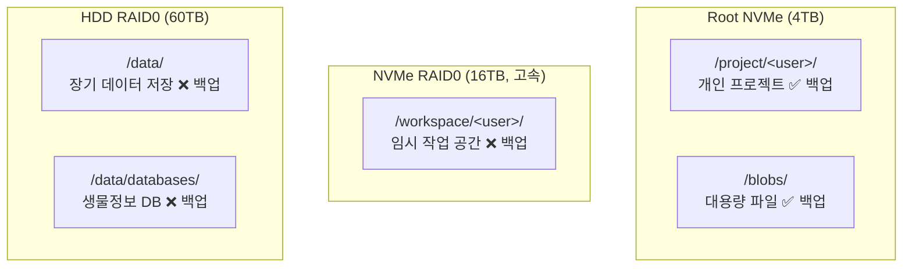

# 개발자 가이드

SSH로 서버에 접속하여 사용하는 연구 컴퓨팅 환경입니다.

## 서버 자원

| 호스트 | 역할 | 주요 자원 |
|--------|------|----------|
| **psi** | GPU 연산 | NVIDIA GPU, 16TB NVMe RAID0, 60TB HDD RAID0 |
| **rho** | 스토리지/빌드 | 대용량 스토리지, Nix 빌드 |
| **tau** | 보조 연산/백업 | 스토리지, PostgreSQL 레플리카 |

## 스토리지 구조 (psi 기준)



| 경로 | 용도 | 백업 |
|------|------|------|
| `/project/<username>/` | 개인 프로젝트 (장기 작업 데이터) | 매일¹ |
| `/workspace/<username>/` | 임시 작업 공간 (고속 SSD) | X |
| `/data/databases/` | 생물정보 DB (db-sync) | X |
| `/blobs/` | 대용량/라이선스 파일 | O |
| `/data/` | 장기 데이터 저장 (60TB HDD) | X |

¹ `/project` 전체 사용량이 10GiB를 넘으면 source guard가 모든 `/project`·`/blobs` 백업을 중단합니다. 이 백업만 중요한 데이터의 유일한 사본으로 사용하지 마세요. 대용량 보호 데이터가 필요하면 작업 전에 관리자와 백업 범위를 협의합니다.

개인 사용량 확인:

```bash
du -sh /project/$USER
```

전체 source guard 상태는 관리자가 Grafana `SjangLab Jobs`에서 확인합니다.

## 시작하기

서버 SSH 접속이 필요하면 관리자에게 **사용자명, SSH 공개키, 접근 호스트**를 전달합니다. 상세 절차는 [SSH 접속 — 접근 요청](ssh-access.md#requesting-access)을 참조하세요.

## 가이드 목록

- [SSH 접속](ssh-access.md) — 접근 요청, 서버 연결 및 설정
- [GPU 컴퓨팅](gpu-computing.md) — CUDA, Docker, 컨테이너
- [Apptainer](apptainer.md) — HPC 컨테이너 환경
- [생물정보 DB](bioinformatics-db.md) — BLAST, UniProt, PDB 등
- [Nix 개발 환경](nix-environment.md) — 패키지, Home Manager, Python, Docker
- [Upterm](../guide/upterm.md) — 임시 터미널 공유 relay
- [학생 가이드](students/best-practices.md) — 모범 사례, 계정 만료

> **서버 하드웨어/전원/네트워크 문제**: 관리자에게 보고하세요. 물리 서버 관리는 [관리자 가이드 — 데이터센터](../admin/datacenter.md)를 참조하세요.
