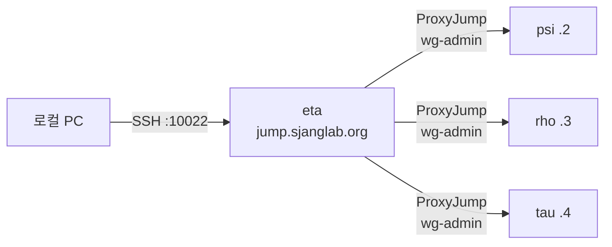

# SSH 접속

## 접근 요청

SSH 서버 접속이 필요하면 관리자에게 다음 정보를 전달합니다:

| 항목 | 예시 | 필수 |
|------|------|------|
| 사용자명 | `jdoe` | O |
| SSH 공개키 | `ssh-ed25519 AAAA...` | O |
| 접근 필요 호스트 | `psi`, `rho` | O |
| 만료일 | `2026-08-31` | 학생/연구원 |

키가 없으면 생성합니다:

```bash
ssh-keygen -t ed25519
cat ~/.ssh/id_ed25519.pub  # 이 내용을 관리자에게 전달
```

관리자가 계정을 생성하고 배포하면 SSH 접속이 가능합니다.

## 접속 방법

모든 SSH 접속은 점프 호스트(`jump.sjanglab.org`)를 경유합니다. 포트는 `10022`입니다.



```bash
# eta (점프 호스트) 직접 접속
ssh -p 10022 <username>@jump.sjanglab.org

# 다른 호스트는 eta를 경유 (ProxyJump)
ssh -p 10022 -J <username>@jump.sjanglab.org:10022 <username>@10.100.0.2
```

## SSH 설정 권장 사항

`~/.ssh/config`:

```
Host eta psi rho tau
    User <username>
    Port 10022
    IdentityFile ~/.ssh/id_ed25519
    ControlMaster auto
    ControlPath ~/.ssh/sockets/%r@%h-%p
    ControlPersist 600

Host eta
    HostName jump.sjanglab.org

Host psi
    HostName 10.100.0.2
    ProxyJump eta

Host rho
    HostName 10.100.0.3
    ProxyJump eta

Host tau
    HostName 10.100.0.4
    ProxyJump eta
```

설정 후 `ssh psi`로 바로 접속할 수 있습니다. `mkdir -p ~/.ssh/sockets`로 소켓 디렉토리를 미리 생성하세요.

`ControlMaster`/`ControlPersist`는 첫 연결의 소켓을 10분간 유지하여, 이후 같은 호스트로의 SSH/SCP/rsync가 재인증 없이 즉시 연결됩니다. ProxyJump 경유 시 특히 유용합니다.

## 서버별 접근

| 호스트 | IP (wg-admin) | 접근 방식 | 비고 |
|--------|--------------|----------|------|
| eta | — | 점프 호스트 (`jump.sjanglab.org`) | Rate limiting 적용 |
| psi | 10.100.0.2 | ProxyJump (eta 경유) | GPU 연산 서버 |
| rho | 10.100.0.3 | ProxyJump (eta 경유) | DB/모니터링 |
| tau | 10.100.0.4 | ProxyJump (eta 경유) | 앱 서버 |

## 보안 설정

- 인증: SSH 공개키만 (비밀번호 불가)
- 키 알고리즘: Ed25519 권장
- 세션 유지: 20분 (ClientAliveInterval 1200초)
- 최대 인증 시도: 3회

## SSH CA 인증서

서버 호스트 키를 자동 신뢰하려면 `~/.ssh/known_hosts`에 추가:

```
@cert-authority *.sjanglab.org ssh-ed25519 AAAAC3NzaC1lZDI1NTE5AAAAIPe1SWRqqZQbGa71jDeAgU+gaIug0lit0r6Q+jQtR1a0
```

## 호스트별 접근 제어

사용자 계정의 `allowedHosts` 설정에 따라 접근 가능한 서버가 제한됩니다. `["all"]`이면 전체, `["rho", "tau"]`이면 해당 서버만 접속 가능합니다.
