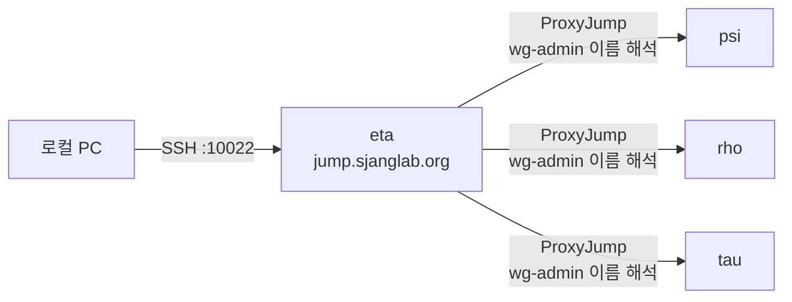

# SSH 접속

## 접근 요청 { #requesting-access }

SSH 서버 접속이 필요하면 [접근 권한 요청](../guide/requesting-access.md#access-request-channel)에 안내된 채널로 다음 정보를 전달합니다:

| 항목 | 예시 | 필수 |
|------|------|------|
| 사용자명 | `jdoe` | O |
| SSH 공개키 | `ssh-ed25519 AAAA...` | O |
| 접근 필요 호스트 | `psi`, `rho` | O |
| 만료일 | `2026-08-31` | 학생/연구원 |

키가 없으면 생성합니다:

```bash
ssh-keygen -t ed25519
cat ~/.ssh/id_ed25519.pub  # 이 내용을 관리자에게 전달
```

관리자가 계정을 생성하고 배포하면 SSH 접속이 가능합니다.

## 접속 방법

외부에서는 공인 점프 호스트(`jump.sjanglab.org`)를 통해 접속합니다. 모든 SSH 서버의 포트는 `10022`입니다.


```mermaid
flowchart LR
  user["로컬 PC"] -- "SSH :10022" --> eta["eta<br/>jump.sjanglab.org"]
  eta -- "ProxyJump<br/>wg-admin 이름 해석" --> psi["psi"]
  eta -- "ProxyJump<br/>wg-admin 이름 해석" --> rho["rho"]
  eta -- "ProxyJump<br/>wg-admin 이름 해석" --> tau["tau"]
```

```bash
# eta (점프 호스트) 직접 접속
ssh -p 10022 <username>@jump.sjanglab.org

# 다른 호스트는 eta를 경유합니다. 대상 FQDN은 eta에서 해석됩니다.
ssh -p 10022 -J <username>@jump.sjanglab.org:10022 <username>@psi.sjanglab.org
```

## 공용 SSH 설정 { #public-ssh-config }

인프라 저장소가 Doctor cluster와 같은 방식으로 공용 SSH 설정 생성기를 제공합니다. `<username>`은 서버 계정명으로 바꿉니다.

```bash
./docs/gen-ssh-config.sh <username>
```

출력을 검토한 뒤 `~/.ssh/config`에 추가합니다. 생성기는 GitHub의 `hosts/*.nix`에서 호스트 목록을 읽고, 공인 eta와 나머지 호스트의 `${host}.sjanglab.org` FQDN 및 ProxyJump를 출력합니다. 대상 FQDN은 eta의 `/etc/hosts`에서 WireGuard 주소로 해석됩니다. WireGuard 주소, 개인 `IdentityFile`, Secretive, multiplex 설정은 포함하지 않습니다.

`ssh eta`는 WireGuard와 독립적인 공인 장애 대응 경로입니다. 연결 장애를 진단할 때는 `-o ControlMaster=no -o ControlPath=none`으로 multiplex를 배제하세요.

## 서버별 접근

| 호스트 | IP (wg-admin) | 접근 방식 | 비고 |
|--------|--------------|----------|------|
| eta | 10.100.0.1 | 공인 점프 호스트 | 공개키 인증 |
| psi | 10.100.0.2 | ProxyJump (eta 경유) | GPU 연산 서버 |
| rho | 10.100.0.3 | ProxyJump (eta 경유) | DB/모니터링 |
| tau | 10.100.0.4 | ProxyJump (eta 경유) | 앱 서버 |

## 보안 설정

- 인증: SSH 공개키만 (비밀번호 불가)
- 키 알고리즘: Ed25519 권장
- 세션 유지: 20분 (ClientAliveInterval 1200초)
- 최대 인증 시도: 3회

## SSH CA 인증서

서버 호스트 키를 자동 신뢰하려면 `~/.ssh/known_hosts`에 추가:

```
@cert-authority *.sjanglab.org ssh-ed25519 AAAAC3NzaC1lZDI1NTE5AAAAIPe1SWRqqZQbGa71jDeAgU+gaIug0lit0r6Q+jQtR1a0
```

## 호스트별 접근 제어

사용자 계정의 `allowedHosts` 설정에 따라 접근 가능한 서버가 제한됩니다. `["all"]`이면 전체, `["rho", "tau"]`이면 해당 서버만 접속 가능합니다.
