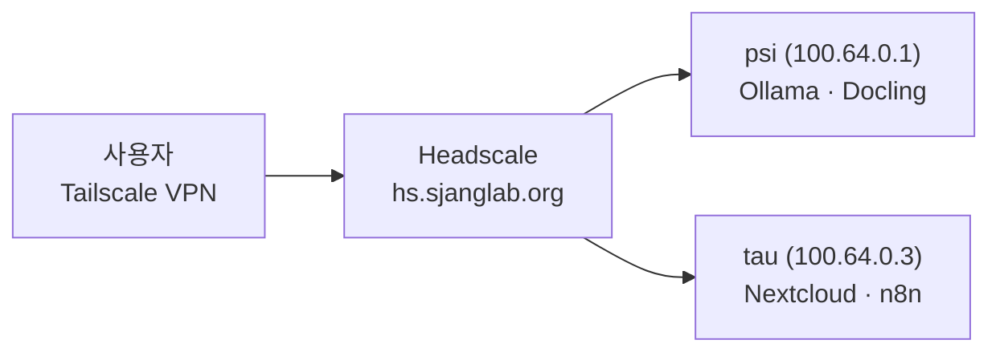

# VPN 설정

모든 서비스는 Headscale(Tailscale 호환) VPN을 통해 접근합니다.

## 1. Tailscale 설치

[tailscale.com/download](https://tailscale.com/download)에서 OS에 맞는 클라이언트를 설치합니다.

### Windows

1. [tailscale.com/download/windows](https://tailscale.com/download/windows)에서 설치 파일을 다운로드합니다
1. 설치를 완료하면 시스템 트레이에 Tailscale 아이콘이 나타납니다

### macOS

1. App Store에서 "Tailscale"을 검색하여 설치합니다
1. 메뉴바에서 Tailscale 아이콘이 나타납니다

### iOS

1. App Store에서 "Tailscale"을 설치합니다
1. 앱을 실행합니다

### Android

1. Google Play에서 "Tailscale"을 설치합니다
1. 앱을 실행합니다

### Linux

```bash
# Debian/Ubuntu
curl -fsSL https://tailscale.com/install.sh | sh

# Nix 사용자
nix run nixpkgs#tailscale -- up --login-server https://hs.sjanglab.org
```

## 2. VPN 연결

Tailscale의 기본 서버 대신 SBEE Lab의 Headscale 서버(`https://hs.sjanglab.org`)에 연결해야 합니다.

### Windows

1. 시스템 트레이의 Tailscale 아이콘을 우클릭합니다
1. **Preferences** (또는 **Settings**)를 엽니다
1. **Use custom server** 항목에 `https://hs.sjanglab.org`을 입력합니다
1. **Log in**을 클릭합니다

또는 PowerShell(관리자)에서:

```powershell
# 레지스트리에 서버 등록
reg add "HKLM\SOFTWARE\Tailscale IPN" /v LoginServer /t REG_SZ /d "https://hs.sjanglab.org" /f

# Tailscale 서비스 재시작
net stop Tailscale & net start Tailscale
```

### macOS / Linux (CLI)

```bash
tailscale login --login-server https://hs.sjanglab.org
```

### iOS

1. 로그인 화면에서 우측 상단 **⋮** (점 세 개) 메뉴를 탭합니다
1. **Change server**를 선택합니다
1. 서버 URL에 `https://hs.sjanglab.org`을 입력합니다
1. **Continue**를 탭합니다

### Android

1. 로그인 화면에서 우측 상단 **⋮** (점 세 개) 메뉴를 탭합니다
1. **Use an alternate server**를 선택합니다
1. 서버 URL에 `https://hs.sjanglab.org`을 입력합니다
1. **Log in**을 탭합니다

______________________________________________________________________

브라우저가 열리면 Authentik으로 로그인합니다. 소속 그룹(`sjanglab-admins`, `sjanglab-researchers`, `sjanglab-students`)에 따라 접근 권한이 자동으로 결정됩니다.

## 3. 연결 확인

```bash
tailscale status
```

정상 연결 시 `100.64.x.x` 대역의 IP가 할당됩니다.

Windows에서는 시스템 트레이의 Tailscale 아이콘이 **Connected** 상태로 표시됩니다.

## 네트워크 구조

VPN 연결 후 Magic DNS로 서비스에 접근할 수 있습니다.



| 도메인 | 내부 IP | 호스트 | 서비스 |
|--------|---------|--------|--------|
| `cloud.sjanglab.org` | 100.64.0.3 | tau | Nextcloud |
| `n8n.sjanglab.org` | 100.64.0.3 | tau | n8n |
| `ollama.sjanglab.org` | 100.64.0.1 | psi | Ollama |
| `docling.sjanglab.org` | 100.64.0.1 | psi | Docling |

## 접근 권한 (ACL)

| 그룹 | 접근 가능 서비스 |
|------|----------------|
| `sjanglab-admins` | AI 서비스 + 앱 + 모니터링 |
| `sjanglab-researchers` | AI 서비스 + 앱 |
| `sjanglab-students` | 앱만 (Nextcloud, Vaultwarden) |

다음 단계: [첫 로그인](first-login.md)
