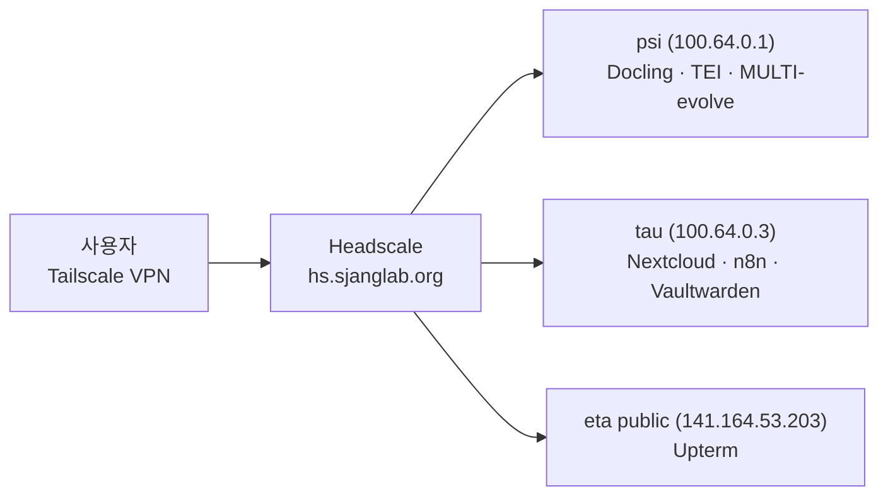

# VPN 설정

모든 서비스는 Headscale(Tailscale 호환) VPN을 통해 접근합니다.

## 1. Tailscale 설치

[tailscale.com/download](https://tailscale.com/download)에서 OS에 맞는 클라이언트를 설치합니다.

### Windows

1. [tailscale.com/download/windows](https://tailscale.com/download/windows)에서 설치 파일을 다운로드합니다
1. 설치를 완료하면 시스템 트레이에 Tailscale 아이콘이 나타납니다

### macOS

1. App Store에서 "Tailscale"을 검색하여 설치합니다
1. 메뉴바에서 Tailscale 아이콘이 나타납니다

### iOS

1. App Store에서 "Tailscale"을 설치합니다
1. 앱을 실행합니다

### Android

1. Google Play에서 "Tailscale"을 설치합니다
1. 앱을 실행합니다

### Linux

```bash
# Debian/Ubuntu
curl -fsSL https://tailscale.com/install.sh | sh

# Nix 사용자
nix run nixpkgs#tailscale -- up --login-server https://hs.sjanglab.org
```

## 2. 기기 이름 확인

Headscale은 VPN 기기 이름을 DNS 이름으로도 사용하므로 영문 소문자, 숫자, 하이픈만 사용해야 합니다.

| 좋은 예 | 피해야 할 예 |
|---------|--------------|
| `lab-imac`, `researcher-macbook`, `student-laptop` | `내 노트북`, `lab pc`, `lab_pc`, `노트북` |

한글, 공백, 밑줄, 특수문자가 포함된 이름으로 등록하면 Headscale에서 `invalid-xxxxxx` 같은 임시 이름으로 표시될 수 있습니다.

CLI를 사용할 수 있으면 로그인 시 이름을 직접 지정할 수 있습니다:

```bash
tailscale up --login-server https://hs.sjanglab.org --hostname lab-imac
```

이미 등록 후 `invalid-*` 이름이 보이면 관리자에게 수정 요청을 보내세요.

## 3. VPN 연결

Tailscale의 기본 서버 대신 SBEE Lab의 Headscale 서버(`https://hs.sjanglab.org`)에 연결해야 합니다.

### Windows

PowerShell 또는 명령 프롬프트에서 Headscale 서버를 지정해 연결합니다. 기기 이름을 함께 고정하려면 `--hostname`을 붙입니다:

```powershell
tailscale up --login-server https://hs.sjanglab.org --hostname lab-imac
```

명령을 찾을 수 없으면 설치 경로의 `tailscale.exe`를 직접 실행합니다:

```powershell
& "$env:ProgramFiles\Tailscale\tailscale.exe" up --login-server https://hs.sjanglab.org --hostname lab-imac
```

관리자가 정책으로 로그인 서버를 고정해야 하는 경우 PowerShell(관리자)에서 설정합니다:

```powershell
reg add "HKLM\SOFTWARE\Policies\Tailscale" /v LoginURL /t REG_SZ /d "https://hs.sjanglab.org" /f
net stop Tailscale & net start Tailscale
```

### macOS / Linux (CLI)

```bash
tailscale up --login-server https://hs.sjanglab.org --hostname lab-imac
```

`lab-imac`은 예시입니다. 실제 기기에 맞는 DNS-safe 이름으로 바꿔 사용하세요.

### iOS

1. 로그인 화면에서 우측 상단 **⋮** (점 세 개) 메뉴를 탭합니다
1. **Change server**를 선택합니다
1. 서버 URL에 `https://hs.sjanglab.org`을 입력합니다
1. **Continue**를 탭합니다

### Android

1. 로그인 화면에서 우측 상단 **⋮** (점 세 개) 메뉴를 탭합니다
1. **Use an alternate server**를 선택합니다
1. 서버 URL에 `https://hs.sjanglab.org`을 입력합니다
1. **Log in**을 탭합니다

______________________________________________________________________

브라우저가 열리면 Authentik으로 로그인합니다. 소속 그룹(`sjanglab-admins`, `sjanglab-researchers`, `sjanglab-students`)에 따라 접근 권한이 자동으로 결정됩니다.

## 4. 연결 확인

```bash
tailscale status
```

정상 연결 시 `100.64.x.x` 대역의 IP가 할당됩니다.

Windows에서는 시스템 트레이의 Tailscale 아이콘이 **Connected** 상태로 표시됩니다.

## 네트워크 구조

VPN 연결 후 Magic DNS로 서비스에 접근할 수 있습니다.


```mermaid
flowchart LR
  user["사용자<br/>Tailscale VPN"] --> hs["Headscale<br/>hs.sjanglab.org"]
  hs --> psi["psi (100.64.0.1)<br/>Docling · TEI · MULTI-evolve"]
  hs --> tau["tau (100.64.0.3)<br/>Nextcloud · n8n · Vaultwarden"]
  hs --> eta_pub["eta public (141.164.53.203)<br/>Upterm"]
```

| 도메인 | 내부 IP | 호스트 | 서비스 |
|--------|---------|--------|--------|
| `cloud.sjanglab.org` | 100.64.0.3 | tau | Nextcloud |
| `n8n.sjanglab.org` | 100.64.0.3 | tau | n8n |
| `docling.sjanglab.org` | 100.64.0.1 | psi | Docling |
| `tei.sjanglab.org` | 100.64.0.1 | psi | TEI |
| `multievolve.sjanglab.org` | 100.64.0.1 | psi | MULTI-evolve |
| `upterm.sjanglab.org` | 141.164.53.203 | eta | Upterm relay |

## 접근 권한 (ACL)

| 그룹 | 접근 가능 서비스 |
|------|----------------|
| `sjanglab-admins` | AI 서비스 + 앱 + 모니터링 |
| `sjanglab-researchers` | AI 서비스 + 앱 |
| `sjanglab-students` | 앱만 (Nextcloud, Vaultwarden) |

다음 단계: [첫 로그인](first-login.md)
