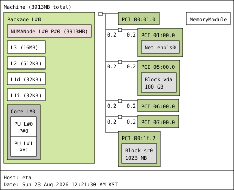

# eta

```
System:
  Kernel: 6.18.39 arch: x86_64 bits: 64 compiler: gcc v: 15.2.0 clocksource: kvm-clock
    avail: tsc,hpet,acpi_pm
    parameters: initrd=\EFI\nixos\5l0sdv8fpppv7wb8nbycb3pdvf57dgpp-initrd-linux-6.18.39-initrd.efi
    init=/nix/store/nfr4frkhhy2fjmkya728ila24xc24mfb-nixos-system-eta-26.11.20260721.26e35aa/init
    console=ttyS0,115200 console=tty0 root=fstab loglevel=4 lsm=landlock,yama,bpf audit=1
    audit_backlog_limit=1024
  Console: N/A Distro: NixOS 26.11 (Zokor)
Machine:
  Type: Microsoft System: Vultr product: VHP v: pc-q35-8.2 serial: <filter> Chassis: QEMU type: 1
    v: pc-q35-8.2 serial: N/A
  Mobo: N/A model: N/A serial: N/A uuid: <filter> Firmware: UEFI
    vendor: Vultr v: N/A date: N/A
Memory:
  System RAM: total: 4 GiB available: 3.82 GiB used: 1.51 GiB (39.6%)
  Array-1: capacity: 4 GiB slots: 1 modules: 1 EC: Multi-bit ECC max-module-size: 4 GiB
    note: est.
  Device-1: DIMM 0 type: RAM detail: N/A size: 4 GiB speed: N/A volts: N/A width: N/A
    manufacturer: Qemu part-no: N/A serial: N/A
PCI Slots:
  Message: No PCI Slot data found.
CPU:
  Info: model: AMD EPYC-Rome bits: 64 type: MT arch: Zen 2 gen: 2 level: v3 note: check
    built: 2020-22 process: TSMC n7 (7nm) family: 0x17 (23) model-id: 0x31 (49) stepping: 0
    microcode: 0x1000065
  Topology: cpus: 1x dies: 1 clusters: 1 cores: 1 threads: 2 tpc: 2 smt: enabled cache:
    L1: 64 KiB desc: d-1x32 KiB; i-1x32 KiB L2: 512 KiB desc: 1x512 KiB L3: 16 MiB desc: 1x16 MiB
  Speed (MHz): avg: 1996 min/max: N/A base/boost: 2000/2000 cores: 1: 1996 2: 1996 bogomips: 7984
  Flags-basic: avx avx2 ht lm nx pae sse sse2 sse3 sse4_1 sse4_2 sse4a ssse3
  Vulnerabilities:
  Type: gather_data_sampling status: Not affected
  Type: ghostwrite status: Not affected
  Type: indirect_target_selection status: Not affected
  Type: itlb_multihit status: Not affected
  Type: l1tf status: Not affected
  Type: mds status: Not affected
  Type: meltdown status: Not affected
  Type: mmio_stale_data status: Not affected
  Type: old_microcode status: Not affected
  Type: reg_file_data_sampling status: Not affected
  Type: retbleed mitigation: untrained return thunk; SMT enabled with STIBP protection
  Type: spec_rstack_overflow status: Vulnerable: Safe RET, no microcode
  Type: spec_store_bypass mitigation: Speculative Store Bypass disabled via prctl
  Type: spectre_v1 mitigation: usercopy/swapgs barriers and __user pointer sanitization
  Type: spectre_v2 mitigation: Retpolines; IBPB: conditional; STIBP: always-on; RSB filling;
    PBRSB-eIBRS: Not affected; BHI: Not affected
  Type: srbds status: Not affected
  Type: tsa status: Not affected
  Type: tsx_async_abort status: Not affected
  Type: vmscape status: Not affected
Graphics:
  Device-1: vendor: Red Hat driver: bochs-drm v: N/A alternate: bochs ports: active: Virtual-1
    empty: none bus-ID: 00:01.0 chip-ID: 1234:1111 class-ID: 0300
  Display: unspecified server: N/A driver: gpu: bochs-drm tty: 80x40
  Monitor-1: Virtual-1 model: QEMU Monitor built: 2014 res: 1280x800 dpi: 100 gamma: 1.2
    size: 325x203mm (12.8x7.99") diag: 383mm (15.1") ratio: 16:10 modes: max: 1280x800 min: 640x480
  API: EGL Message: No EGL data available.
  API: OpenGL Message: GL data unavailable in console for root.
  Info: Tools: api: eglinfo,glxinfo x11: xdpyinfo, xprop, xrandr
Audio:
  Device-1: Intel 82801I HD Audio vendor: Red Hat QEMU Virtual Machine driver: snd_hda_intel
    v: kernel bus-ID: 00:1b.0 chip-ID: 8086:293e class-ID: 0403
  API: ALSA v: k6.18.39 status: kernel-api tools: N/A
Network:
  Device-1: Red Hat Virtio 1.0 network driver: virtio-pci v: 1 modules: virtio_pci pcie: gen: 1
    speed: 2.5 GT/s lanes: 1 port: N/A bus-ID: 01:00.0 chip-ID: 1af4:1041 class-ID: 0200
  IF-ID-1: enp1s0 state: up speed: -1 duplex: unknown mac: <filter>
  IP v4: <filter> scope: global broadcast: <filter>
  IP v6: <filter> virtual: proto kernel_ll scope: link
  IF-ID-2: tinc.naru state: down mac: N/A
  IF-ID-3: wg-admin state: unknown speed: N/A duplex: N/A mac: N/A
  IP v4: <filter> scope: global
  Info: services: nginx, sshd, systemd-networkd, systemd-timesyncd
  WAN IP: <filter>
Drives:
  Local Storage: total: 100 GiB used: 32.87 GiB (32.9%)
  ID-1: /dev/vda maj-min: 253:0 model: N/A size: 100 GiB block-size: physical: 512 B
    logical: 512 B speed: <unknown> tech: N/A serial: N/A scheme: GPT
  SMART Message: Unknown smartctl error. Unable to generate data.
Partition:
  ID-1: / raw-size: 99.5 GiB size: 97.38 GiB (97.87%) used: 32.79 GiB (33.7%) fs: ext4
    block-size: 4096 B dev: /dev/vda2 maj-min: 253:2
  ID-2: /boot raw-size: 512 MiB size: 511 MiB (99.80%) used: 84.4 MiB (16.5%) fs: vfat
    block-size: 512 B dev: /dev/vda1 maj-min: 253:1
Swap:
  Kernel: swappiness: 10 (default 60) cache-pressure: 50 (default 100) zswap: no
  ID-1: swap-1 type: zram size: 1.91 GiB used: 587.9 MiB (30.1%) priority: 100 comp: zstd
    avail: lzo-rle,lzo,lz4,lz4hc,deflate,842 dev: /dev/zram0
Sensors:
  Src: lm-sensors+/sys Message: No sensor data found using /sys/class/hwmon or lm-sensors.
Info:
  Processes: 200 Power: uptime: 28d 0h 15m states: freeze,mem,disk suspend: deep avail: s2idle
    wakeups: 0 hibernate: platform avail: shutdown, reboot, suspend, test_resume image: 1.5 GiB
    Init: systemd v: 261 default: multi-user tool: systemctl
  Packages: pm: nix-default pkgs: 0 pm: nix-sys pkgs: 588 libs: 58 pm: nix-usr pkgs: 0 Compilers:
    gcc: 15.3.0 Client: Sudo v: 1.9.17p2 inxi: 3.3.41
```


