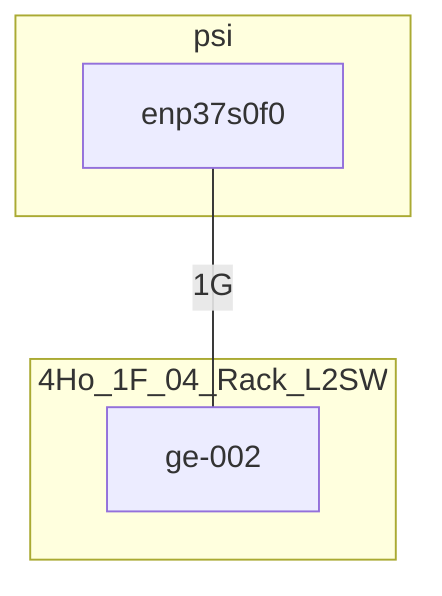

```mermaid
  graph TD
      psi.enp37s0f0["enp37s0f0"]-- 1G ---4Ho_1F_04_Rack_L2SW.ge-002["ge-002"]
      subgraph 4Ho_1F_04_Rack_L2SW
      4Ho_1F_04_Rack_L2SW.ge-002["ge-002"]
      end
      subgraph psi
      psi.enp37s0f0["enp37s0f0"]
      end
      click psi.enp37s0f0 "https://github.com/SBEE-Lab/infra/blob/main/docs/hosts/psi.md" "psi"
```
