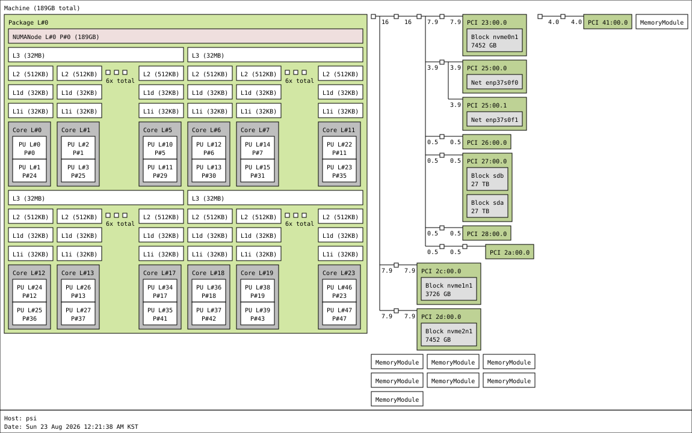

# psi

```
System:
  Kernel: 6.18.43 arch: x86_64 bits: 64 compiler: gcc v: 15.3.0 clocksource: tsc avail: acpi_pm
    parameters: initrd=\EFI\nixos\mkmz7rxi3kzqq0nxw2l2hdw5xgav2z2g-initrd-linux-6.18.43-initrd.efi
    init=/nix/store/z00jr1ib4mzp4jpfalgicm468cpllzgn-nixos-system-psi-26.11.20260811.8c84612/init
    console=ttyS0,115200 console=tty0 root=fstab loglevel=4 lsm=landlock,yama,bpf audit=1
    audit_backlog_limit=1024
  Console: N/A Distro: NixOS 26.11 (Zokor)
Machine:
  Type: Desktop System: ASUS product: N/A v: N/A serial: N/A
  Mobo: ASUSTeK model: Pro WS WRX80E-SAGE SE WIFI v: Rev 1.xx serial: <filter> part-nu: SKU
    uuid: <filter> Firmware: UEFI vendor: American Megatrends v: 1602
    date: 09/04/2024
Memory:
  System RAM: total: 192 GiB available: 188.53 GiB used: 37.19 GiB (19.7%)
  Array-1: capacity: 512 GiB slots: 8 modules: 3 EC: Multi-bit ECC max-module-size: 64 GiB
    note: est.
  Device-1: Channel-A DIMM 0 type: DDR4 detail: synchronous registered (buffered) size: 64 GiB
    speed: 3200 MT/s volts: curr: 1.2 min: 1.2 max: 1.2 width (bits): data: 64 total: 72
    manufacturer: Samsung part-no: M393A8G40AB2-CWE serial: <filter>
  Device-2: Channel-B DIMM 0 type: no module installed
  Device-3: Channel-C DIMM 0 type: DDR4 detail: synchronous registered (buffered) size: 64 GiB
    speed: 3200 MT/s volts: curr: 1.2 min: 1.2 max: 1.2 width (bits): data: 64 total: 72
    manufacturer: Samsung part-no: M393A8G40AB2-CWE serial: <filter>
  Device-4: Channel-D DIMM 0 type: no module installed
  Device-5: Channel-E DIMM 0 type: no module installed
  Device-6: Channel-F DIMM 0 type: no module installed
  Device-7: Channel-G DIMM 0 type: DDR4 detail: synchronous registered (buffered) size: 64 GiB
    speed: 3200 MT/s volts: curr: 1.2 min: 1.2 max: 1.2 width (bits): data: 64 total: 72
    manufacturer: Samsung part-no: M393A8G40AB2-CWE serial: <filter>
  Device-8: Channel-H DIMM 0 type: no module installed
PCI Slots:
  Slot: 0 type: PCIe status: in use length: long volts: 3.3 bus-ID: 00:00.0
  Slot: 1 type: PCIe status: in use length: long volts: 3.3 bus-ID: 00:00.0
  Slot: 2 type: PCIe status: in use length: long volts: 3.3 bus-ID: 00:00.0
  Slot: 3 type: PCIe status: in use length: long volts: 3.3 bus-ID: 00:00.0
CPU:
  Info: model: AMD Ryzen Threadripper PRO 5965WX s socket: SP3 bits: 64 type: MT MCP arch: Zen 3
    gen: 3 level: v3 note: check built: 2021-22 process: TSMC n7 (7nm) family: 0x19 (25) model-id: 8
    stepping: 2 microcode: 0xA00820C
  Topology: cpus: 1x dies: 1 clusters: 1 cores: 24 threads: 48 tpc: 2 smt: enabled cache:
    L1: 1.5 MiB desc: d-24x32 KiB; i-24x32 KiB L2: 12 MiB desc: 24x512 KiB L3: 128 MiB desc: 4x32 MiB
  Speed (MHz): avg: 2397 min/max: 413/4572 boost: enabled base/boost: 3800/4550 scaling:
    driver: amd-pstate-epp governor: powersave volts: 1.1 V ext-clock: 100 MHz cores: 1: 2397 2: 2397
    3: 2397 4: 2397 5: 2397 6: 2397 7: 2397 8: 2397 9: 2397 10: 2397 11: 2397 12: 2397 13: 2397
    14: 2397 15: 2397 16: 2397 17: 2397 18: 2397 19: 2397 20: 2397 21: 2397 22: 2397 23: 2397
    24: 2397 25: 2397 26: 2397 27: 2397 28: 2397 29: 2397 30: 2397 31: 2397 32: 2397 33: 2397
    34: 2397 35: 2397 36: 2397 37: 2397 38: 2397 39: 2397 40: 2397 41: 2397 42: 2397 43: 2397
    44: 2397 45: 2397 46: 2397 47: 2397 48: 2397 bogomips: 364107
  Flags-basic: avx avx2 ht lm nx pae sse sse2 sse3 sse4_1 sse4_2 sse4a ssse3 svm
  Vulnerabilities:
  Type: gather_data_sampling status: Not affected
  Type: ghostwrite status: Not affected
  Type: indirect_target_selection status: Not affected
  Type: itlb_multihit status: Not affected
  Type: l1tf status: Not affected
  Type: mds status: Not affected
  Type: meltdown status: Not affected
  Type: mmio_stale_data status: Not affected
  Type: old_microcode status: Not affected
  Type: reg_file_data_sampling status: Not affected
  Type: retbleed status: Not affected
  Type: spec_rstack_overflow mitigation: Safe RET
  Type: spec_store_bypass mitigation: Speculative Store Bypass disabled via prctl
  Type: spectre_v1 mitigation: usercopy/swapgs barriers and __user pointer sanitization
  Type: spectre_v2 mitigation: Retpolines; IBPB: conditional; IBRS_FW; STIBP: always-on; RSB
    filling; PBRSB-eIBRS: Not affected; BHI: Not affected
  Type: srbds status: Not affected
  Type: tsa status: Vulnerable: No microcode
  Type: tsx_async_abort status: Not affected
  Type: vmscape mitigation: IBPB before exit to userspace
Graphics:
  Device-1: ASPEED Graphics Family driver: ast v: kernel ports: active: VGA-1 empty: none
    bus-ID: 2a:00.0 chip-ID: 1a03:2000 class-ID: 0300
  Device-2: NVIDIA GA102GL [RTX A6000] driver: nvidia v: 595.91.07
    alternate: nvidiafb,nouveau,nvidia_drm non-free: 550-6xx.xx+ status: current (as of 2026-07)
    arch: Ampere code: GAxxx process: TSMC n7 (7nm) built: 2020-2023 pcie: gen: 1 speed: 2.5 GT/s
    lanes: 16 link-max: gen: 4 speed: 16 GT/s ports: active: none empty: DP-1, DP-2, DP-3, DP-4
    bus-ID: 41:00.0 chip-ID: 10de:2230 class-ID: 0300
  Display: server: No display server data found. Headless machine? tty: 80x40
  Monitor-1: VGA-1 size-res: N/A in console modes: max: 1024x768 min: 640x480
  API: EGL v: 1.5 hw: drv: nvidia platforms: device: 0 drv: nvidia device: 2 drv: swrast
    surfaceless: drv: nvidia inactive: gbm,wayland,x11,device-1
  API: OpenGL v: 4.6.0 compat-v: 4.6 vendor: mesa v: 26.2.0 note: console (EGL sourced)
    renderer: NVIDIA RTX A6000/PCIe/SSE2, llvmpipe (LLVM 21.1.8 256 bits)
  Info: Tools: api: eglinfo,glxinfo gpu: nvidia-settings,nvidia-smi x11: xdpyinfo, xprop, xrandr
Audio:
  Device-1: Advanced Micro Devices [AMD] Starship/Matisse HD Audio vendor: ASUSTeK driver: N/A
    alternate: snd_hda_intel pcie: gen: 4 speed: 16 GT/s lanes: 16 bus-ID: 2f:00.4 chip-ID: 1022:1487
    class-ID: 0403
  Device-2: NVIDIA GA102 High Definition Audio driver: snd_hda_intel v: kernel pcie: gen: 4
    speed: 16 GT/s lanes: 16 bus-ID: 41:00.1 chip-ID: 10de:1aef class-ID: 0403
  Device-3: ASUSTek USB Audio driver: hid-generic,snd-usb-audio,usbhid type: USB rev: 2.0
    speed: 480 Mb/s lanes: 1 mode: 2.0 bus-ID: 5-6:3 chip-ID: 0b05:1984 class-ID: 0300
  API: ALSA v: k6.18.43 status: kernel-api tools: N/A
Network:
  Device-1: Intel Ethernet X550 vendor: ASUSTeK driver: ixgbe v: kernel pcie: gen: 3 speed: 8 GT/s
    lanes: 4 port: N/A bus-ID: 25:00.0 chip-ID: 8086:1563 class-ID: 0200
  IF: enp37s0f0 state: up speed: 1000 Mbps duplex: full mac: <filter>
  IP v4: <filter> scope: global broadcast: <filter>
  IP v6: <filter> virtual: proto kernel_ll scope: link
  Device-2: Intel Ethernet X550 vendor: ASUSTeK driver: ixgbe v: kernel pcie: gen: 3
    speed: 8 GT/s lanes: 4 port: N/A bus-ID: 25:00.1 chip-ID: 8086:1563 class-ID: 0200
  IF: enp37s0f1 state: down mac: <filter>
  Device-3: Intel Wi-Fi 6 AX200 driver: N/A modules: iwlwifi pcie: gen: 2 speed: 5 GT/s lanes: 1
    bus-ID: 26:00.0 chip-ID: 8086:2723 class-ID: 0280
  IF-ID-1: docker0 state: up speed: 10000 Mbps duplex: unknown mac: <filter>
  IP v4: <filter> scope: global broadcast: <filter>
  IP v6: <filter> virtual: proto kernel_ll scope: link
  IF-ID-2: tailscale0 state: unknown speed: -1 duplex: full mac: N/A
  IP v4: <filter> scope: global
  IP v6: <filter> scope: global
  IP v6: <filter> virtual: stable-privacy proto kernel_ll scope: link
  IF-ID-3: tinc.naru state: down mac: N/A
  IF-ID-4: veth53e7381 state: up speed: 10000 Mbps duplex: full mac: <filter>
  IF-ID-5: wg-admin state: unknown speed: N/A duplex: N/A mac: N/A
  IP v4: <filter> scope: global
  Info: services: nginx, sshd, systemd-networkd, systemd-timesyncd
  WAN IP: <filter>
Bluetooth:
  Device-1: Intel AX200 Bluetooth driver: btusb v: 0.8 type: USB rev: 2.0 speed: 12 Mb/s lanes: 1
    mode: 1.1 bus-ID: 3-6:4 chip-ID: 8087:0029 class-ID: e001
  Report: rfkill ID: hci0 rfk-id: 0 state: down bt-service: not found rfk-block: hardware: no
    software: no address: see --recommends
RAID:
  Supported mdraid levels: raid0
  Device-1: md126 maj-min: 9:126 type: mdraid level: raid-0 status: active state: clean
    size: 54.57 TiB
  Info: report: N/A blocks: 58594158592 chunk-size: 512k super-blocks: 1.2
  Components: Online:
  0: sda1 maj-min: 8:1 size: 27.29 TiB state: active sync
  1: sdb1 maj-min: 8:17 size: 27.29 TiB state: active sync
  Device-2: md127 maj-min: 9:127 type: mdraid level: raid-0 status: active state: clean
    size: 14.55 TiB
  Info: report: N/A blocks: 15627786240 chunk-size: 512k super-blocks: 1.2
  Components: Online:
  0: nvme0n1p1 maj-min: 259:6 size: 7.28 TiB state: active sync
  1: nvme2n1p1 maj-min: 259:7 size: 7.28 TiB state: active sync
Drives:
  Local Storage: total: raw: 72.76 TiB usable: 72.76 TiB used: 20.21 TiB (27.8%)
  ID-1: /dev/nvme0n1 maj-min: 259:4 vendor: Samsung model: SSD 9100 PRO 8TB size: 7.28 TiB
    block-size: physical: 512 B logical: 512 B speed: 126 Gb/s lanes: 4 tech: SSD serial: <filter>
    fw-rev: 0B2QNXH7 temp: 36.9 C scheme: GPT
  SMART: yes health: PASSED on: 7d 14h cycles: 8 read-units: 348,751,292 [178 TB]
    written-units: 239,441,784 [122 TB]
  ID-2: /dev/nvme1n1 maj-min: 259:0 vendor: Samsung model: SSD 990 PRO 4TB size: 3.64 TiB
    block-size: physical: 512 B logical: 512 B speed: 63.2 Gb/s lanes: 4 tech: SSD serial: <filter>
    fw-rev: 4B2QJXD7 temp: 31.9 C scheme: GPT
  SMART: yes health: PASSED on: 242d 16h cycles: 59 read-units: 329,071,619 [168 TB]
    written-units: 391,548,296 [200 TB]
  ID-3: /dev/nvme2n1 maj-min: 259:5 vendor: Samsung model: SSD 9100 PRO 8TB size: 7.28 TiB
    block-size: physical: 512 B logical: 512 B speed: 126 Gb/s lanes: 4 tech: SSD serial: <filter>
    fw-rev: 0B2QNXH7 temp: 35.9 C scheme: GPT
  SMART: yes health: PASSED on: 7d 16h cycles: 8 read-units: 348,202,090 [178 TB]
    written-units: 239,830,268 [122 TB]
  ID-4: /dev/sda maj-min: 8:0 vendor: Seagate model: ST30000NT011-3V2103
    family: IronWolf Pro (HAMR) size: 27.29 TiB block-size: physical: 4096 B logical: 512 B sata: 3.3
    speed: 6.0 Gb/s tech: HDD rpm: 7200 serial: <filter> fw-rev: EN02 temp: 42 C scheme: GPT
  SMART: yes state: enabled health: PASSED on: 268d 19h cycles: 10 read: 13.76 TiB
    written: 23.72 TiB Pre-Fail: attribute: Spin_Retry_Count value: 100 worst: 100 threshold: 97
  ID-5: /dev/sdb maj-min: 8:16 vendor: Seagate model: ST30000NT011-3V2103
    family: IronWolf Pro (HAMR) size: 27.29 TiB block-size: physical: 4096 B logical: 512 B sata: 3.3
    speed: 6.0 Gb/s tech: HDD rpm: 7200 serial: <filter> fw-rev: EN02 temp: 38 C scheme: GPT
  SMART: yes state: enabled health: PASSED on: 268d 19h cycles: 10 read: 13.38 TiB
    written: 24.1 TiB Pre-Fail: attribute: Spin_Retry_Count value: 100 worst: 100 threshold: 97
Partition:
  ID-1: / raw-size: 3.64 TiB size: 3.64 TiB (99.95%) used: 1.79 TiB (49.3%) fs: xfs
    block-size: 512 B dev: /dev/nvme1n1p3 maj-min: 259:3
  ID-2: /boot raw-size: 1024 MiB size: 1022 MiB (99.80%) used: 113.5 MiB (11.1%) fs: vfat
    block-size: 512 B dev: /dev/nvme1n1p2 maj-min: 259:2
Swap:
  Kernel: swappiness: 10 (default 60) cache-pressure: 50 (default 100) zswap: no
  ID-1: swap-1 type: zram size: 94.26 GiB used: 7.3 MiB (0.0%) priority: 100 comp: zstd
    avail: lzo-rle,lzo,lz4,lz4hc,deflate,842 dev: /dev/zram0
Sensors:
  Src: ipmi System Temperatures: cpu: N/A mobo: N/A
  Fan Speeds (rpm): cpu: 2900
  Power: 12v: 12.060 5v: N/A 3.3v: N/A vbat: 3.184 dimm-p1: N/A dimm-p2: N/A
  Src: lm-sensors System Temperatures: cpu: 33.5 C mobo: N/A gpu: nvidia temp: 25 C
  Fan Speeds (rpm): N/A
Info:
  Processes: 662 Power: uptime: 10d 9h 0m states: freeze,mem,disk suspend: deep avail: s2idle
    wakeups: 0 hibernate: platform avail: shutdown, reboot, suspend, test_resume image: 75.38 GiB
    Init: systemd v: 261 default: multi-user tool: systemctl
  Packages: pm: nix-default pkgs: 0 pm: nix-sys pkgs: 557 libs: 86 pm: nix-usr pkgs: 0 Compilers:
    gcc: 15.3.0 Client: Sudo v: 1.9.17p2 inxi: 3.3.41
```


