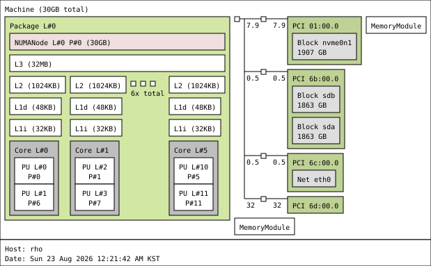

# rho

```
System:
  Kernel: 6.18.39 arch: x86_64 bits: 64 compiler: gcc v: 15.3.0 clocksource: tsc
    avail: hpet,acpi_pm
    parameters: initrd=\EFI\nixos\jawzyyxb7lw2na2s4d5b5bnqdpmqf7ba-initrd-linux-6.18.39-initrd.efi
    init=/nix/store/vfc2n5v5j022vy6wwhf27nbn5vx7x4bb-nixos-system-rho-26.11.20260726.5471b86/init
    console=ttyS0,115200 console=tty0 root=fstab loglevel=4 lsm=landlock,yama,bpf audit=1
    audit_backlog_limit=1024
  Console: N/A Distro: NixOS 26.11 (Zokor)
Machine:
  Type: Desktop Mobo: ASRock model: X600M-STX serial: <filter>
    uuid: <filter> Firmware: UEFI vendor: American Megatrends LLC.
    v: 4.08 date: 12/05/2024
Memory:
  System RAM: total: 32 GiB available: 30.44 GiB used: 3.63 GiB (11.9%)
  Array-1: capacity: 128 GiB slots: 2 modules: 2 EC: None max-module-size: 64 GiB note: est.
  Device-1: Channel-A DIMM 0 type: DDR5 detail: synchronous unbuffered (unregistered)
    size: 16 GiB speed: spec: 5600 MT/s actual: 4800 MT/s volts: curr: 1.1 min: 1.1 max: 1.1
    width (bits): data: 64 total: 64 manufacturer: Samsung part-no: M425R2GA3BB0-CWMOL
    serial: <filter>
  Device-2: Channel-B DIMM 0 type: DDR5 detail: synchronous unbuffered (unregistered)
    size: 16 GiB speed: spec: 5600 MT/s actual: 4800 MT/s volts: curr: 1.1 min: 1.1 max: 1.1
    width (bits): data: 64 total: 64 manufacturer: Samsung part-no: M425R2GA3BB0-CWMOL
    serial: <filter>
PCI Slots:
  Message: No PCI Slot data found.
CPU:
  Info: model: AMD Ryzen 5 9600X socket: AM5 bits: 64 type: MT MCP arch: Zen 5 gen: 5 level: v4
    note: check built: 2024+ process: TSMC n4 (4nm) family: 0x1A (26) model-id: 0x44 (68) stepping: 0
    microcode: 0xB404023
  Topology: cpus: 1x dies: 1 clusters: 1 cores: 6 threads: 12 tpc: 2 smt: enabled cache:
    L1: 480 KiB desc: d-6x48 KiB; i-6x32 KiB L2: 6 MiB desc: 6x1024 KiB L3: 32 MiB desc: 1x32 MiB
  Speed (MHz): avg: 2384 min/max: 628/5486 boost: enabled base/boost: 3900/5450 scaling:
    driver: amd-pstate-epp governor: powersave volts: 1.3 V ext-clock: 100 MHz cores: 1: 2384 2: 2384
    3: 2384 4: 2384 5: 2384 6: 2384 7: 2384 8: 2384 9: 2384 10: 2384 11: 2384 12: 2384
    bogomips: 93421
  Flags-basic: avx avx2 ht lm nx pae sse sse2 sse3 sse4_1 sse4_2 sse4a ssse3 svm
  Vulnerabilities:
  Type: gather_data_sampling status: Not affected
  Type: ghostwrite status: Not affected
  Type: indirect_target_selection status: Not affected
  Type: itlb_multihit status: Not affected
  Type: l1tf status: Not affected
  Type: mds status: Not affected
  Type: meltdown status: Not affected
  Type: mmio_stale_data status: Not affected
  Type: old_microcode status: Not affected
  Type: reg_file_data_sampling status: Not affected
  Type: retbleed status: Not affected
  Type: spec_rstack_overflow mitigation: IBPB on VMEXIT only
  Type: spec_store_bypass mitigation: Speculative Store Bypass disabled via prctl
  Type: spectre_v1 mitigation: usercopy/swapgs barriers and __user pointer sanitization
  Type: spectre_v2 mitigation: Enhanced / Automatic IBRS; IBPB: conditional; STIBP: always-on;
    PBRSB-eIBRS: Not affected; BHI: Not affected
  Type: srbds status: Not affected
  Type: tsa status: Not affected
  Type: tsx_async_abort status: Not affected
  Type: vmscape mitigation: IBPB on VMEXIT
Graphics:
  Device-1: Advanced Micro Devices [AMD/ATI] Granite Ridge [Radeon Graphics] vendor: ASRock
    driver: amdgpu v: kernel arch: RDNA-2 code: Navi-2x process: TSMC n7 (7nm) built: 2020-22 pcie:
    gen: 4 speed: 16 GT/s lanes: 16 ports: active: none empty: DP-1, DP-2, HDMI-A-1, Writeback-1
    bus-ID: 6d:00.0 chip-ID: 1002:13c0 class-ID: 0300 temp: 48.0 C
  Display: server: No display server data found. Headless machine? tty: 80x40
  API: EGL Message: No EGL data available.
  API: OpenGL Message: GL data unavailable in console for root.
  Info: Tools: api: eglinfo,glxinfo x11: xdpyinfo, xprop, xrandr
Audio:
  Device-1: Advanced Micro Devices [AMD/ATI] Radeon High Definition Audio driver: snd_hda_intel
    v: kernel pcie: gen: 4 speed: 16 GT/s lanes: 16 bus-ID: 6d:00.1 chip-ID: 1002:1640 class-ID: 0403
  Device-2: Advanced Micro Devices [AMD] Ryzen HD Audio vendor: ASRock driver: snd_hda_intel
    v: kernel pcie: gen: 4 speed: 16 GT/s lanes: 16 bus-ID: 6d:00.6 chip-ID: 1022:15e3 class-ID: 0403
  API: ALSA v: k6.18.39 status: kernel-api tools: N/A
Network:
  Device-1: Realtek RTL8125 2.5GbE vendor: ASRock driver: r8169 v: kernel pcie: gen: 2
    speed: 5 GT/s lanes: 1 port: e000 bus-ID: 6c:00.0 chip-ID: 10ec:8125 class-ID: 0200
  IF: eth0 state: up speed: 1000 Mbps duplex: full mac: <filter>
  IP v4: <filter> scope: global broadcast: <filter>
  IP v6: <filter> virtual: proto kernel_ll scope: link
  IF-ID-1: tailscale0 state: unknown speed: -1 duplex: full mac: N/A
  IP v4: <filter> scope: global
  IP v6: <filter> scope: global
  IP v6: <filter> virtual: stable-privacy proto kernel_ll scope: link
  IF-ID-2: tinc.naru state: down mac: N/A
  IF-ID-3: wg-admin state: unknown speed: N/A duplex: N/A mac: N/A
  IP v4: <filter> scope: global
  Info: services: nginx, sshd, systemd-networkd, systemd-timesyncd
  WAN IP: <filter>
RAID:
  Supported mdraid levels: raid0
  Device-1: md127 maj-min: 9:127 type: mdraid level: raid-0 status: active state: clean
    size: 3.64 TiB
  Info: report: N/A blocks: 3906762752 chunk-size: 512k super-blocks: 1.2
  Components: Online:
  0: sdb1 maj-min: 8:17 size: 1.82 TiB state: active sync
  1: sda1 maj-min: 8:1 size: 1.82 TiB state: active sync
Drives:
  Local Storage: total: raw: 5.5 TiB usable: 5.5 TiB used: 193.39 GiB (3.4%)
  ID-1: /dev/nvme0n1 maj-min: 259:0 vendor: Imation model: M.2 PCIe 2TB SSD Z981 size: 1.86 TiB
    block-size: physical: 512 B logical: 512 B speed: 63.2 Gb/s lanes: 4 tech: SSD serial: <filter>
    fw-rev: ERFM11.2 temp: 31.9 C scheme: GPT
  SMART: yes health: PASSED on: 347d 16h cycles: 51 read-units: 4,210,216 [2.15 TB]
    written-units: 23,647,004 [12.1 TB]
  ID-2: /dev/sda maj-min: 8:0 vendor: Western Digital model: WD20SPZX-00UA7T0
    family: Blue Mobile (SMR) size: 1.82 TiB block-size: physical: 4096 B logical: 512 B sata: 3.1
    speed: 6.0 Gb/s tech: HDD rpm: 5400 serial: <filter> fw-rev: 1A01 temp: 35 C scheme: GPT
  SMART: yes state: enabled health: PASSED on: 348d 3h cycles: 50
  ID-3: /dev/sdb maj-min: 8:16 vendor: Western Digital model: WD20SPZX-00UA7T0
    family: Blue Mobile (SMR) size: 1.82 TiB block-size: physical: 4096 B logical: 512 B sata: 3.1
    speed: 6.0 Gb/s tech: HDD rpm: 5400 serial: <filter> fw-rev: 1A01 temp: 35 C scheme: GPT
  SMART: yes state: enabled health: PASSED on: 348d 14h cycles: 50
Partition:
  ID-1: / raw-size: 1.86 TiB size: 1.86 TiB (99.95%) used: 76.69 GiB (4.0%) fs: xfs
    block-size: 512 B dev: /dev/nvme0n1p3 maj-min: 259:3
  ID-2: /boot raw-size: 1024 MiB size: 1022 MiB (99.80%) used: 114.1 MiB (11.2%) fs: vfat
    block-size: 512 B dev: /dev/nvme0n1p2 maj-min: 259:2
Swap:
  Kernel: swappiness: 10 (default 60) cache-pressure: 50 (default 100) zswap: no
  ID-1: swap-1 type: zram size: 15.22 GiB used: 0 KiB (0.0%) priority: 100 comp: zstd
    avail: lzo-rle,lzo,lz4,lz4hc,deflate,842 dev: /dev/zram0
Sensors:
  System Temperatures: cpu: 54.2 C mobo: 35.5 C gpu: amdgpu temp: 48.0 C
  Fan Speeds (rpm): N/A
Info:
  Processes: 300 Power: uptime: 13d 2h 27m states: freeze,mem,disk suspend: deep avail: s2idle
    wakeups: 0 hibernate: platform avail: shutdown, reboot, suspend, test_resume image: 12.11 GiB
    Init: systemd v: 261 default: multi-user tool: systemctl
  Packages: pm: nix-default pkgs: 0 pm: nix-sys pkgs: 438 libs: 54 pm: nix-usr pkgs: 0 Compilers:
    gcc: 15.3.0 Client: Sudo v: 1.9.17p2 inxi: 3.3.41
```


